# Booting dan Instalasi Debian
  ## Proses Instalasi Virtual Box

  1) Buka situs resmi VirtualBox di https://www.virtualbox.org/
[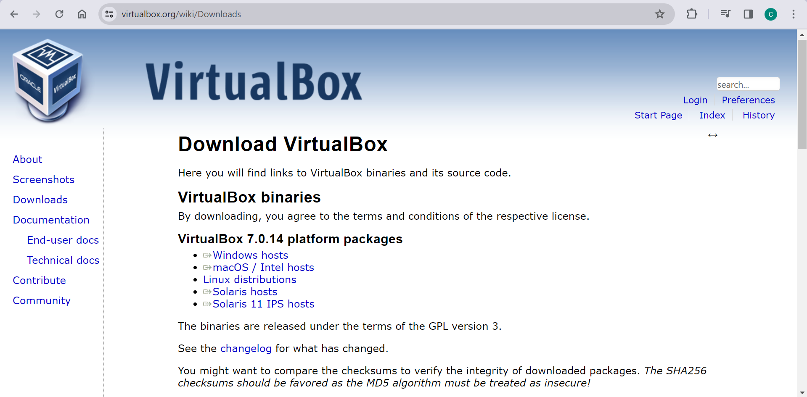]()

1) Pilih versi VirtualBox yang sesuai dengan Sistem Operasi anda, lalu pilih "Donwloads".

1) Buka file installer yang telah diunduh.

1) Pilih Next pada pop up VirtualBox

1) Selanjutnya, pilih Install
[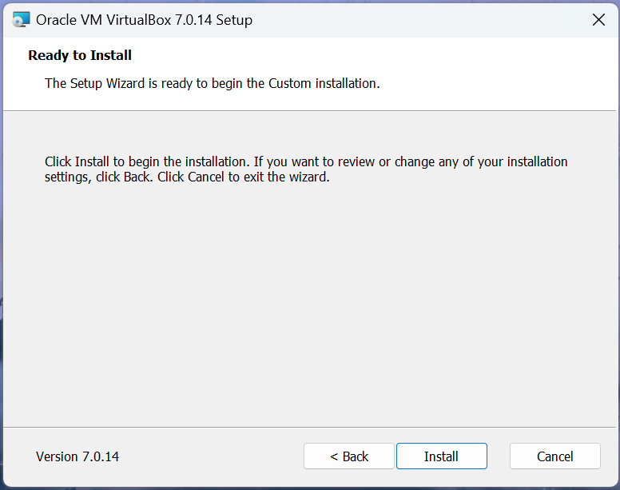]()

1) Tunggu hingga proses instalasi selesai
[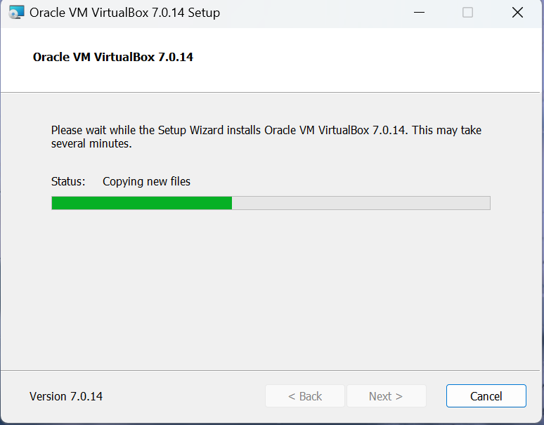]()

1) Klik finish

## Proses Booting
1) Setelah halaman VirtualBox terbuka, pilih new
[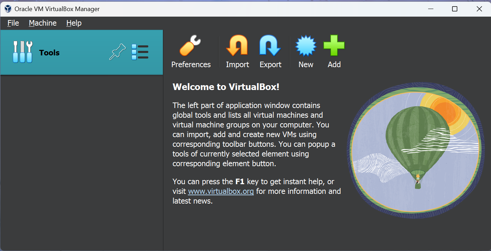]()

1) Setelah halaman VirtualBox terbuka, pilih new

1) Setelah halaman VirtualBox terbuka, pilih new

1) Setelah halaman VirtualBox terbuka, pilih new
[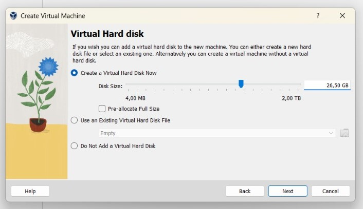]()

1) Setelah halaman VirtualBox terbuka, pilih new

1) Setelah halaman VirtualBox terbuka, pilih new

1) Setelah halaman VirtualBox terbuka, pilih new
[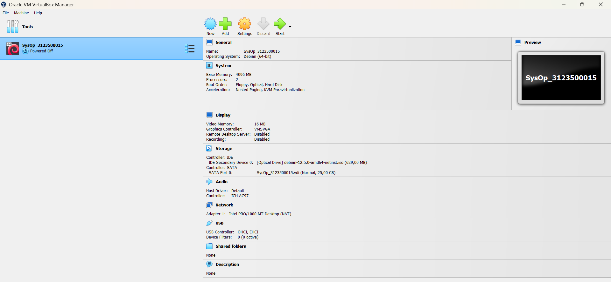]()

1) Setelah halaman VirtualBox terbuka, pilih new
[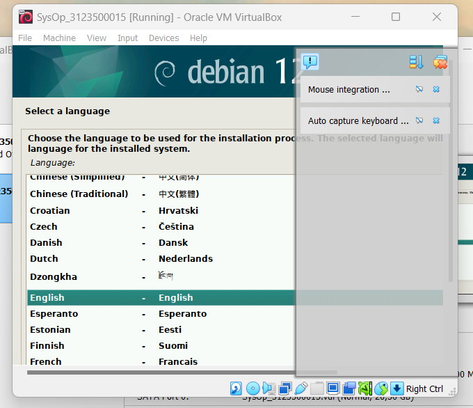]()

1) Setelah halaman VirtualBox terbuka, pilih new

1) Setelah halaman VirtualBox terbuka, pilih new

1) Setelah halaman VirtualBox terbuka, pilih new

1) Setelah halaman VirtualBox terbuka, pilih new
[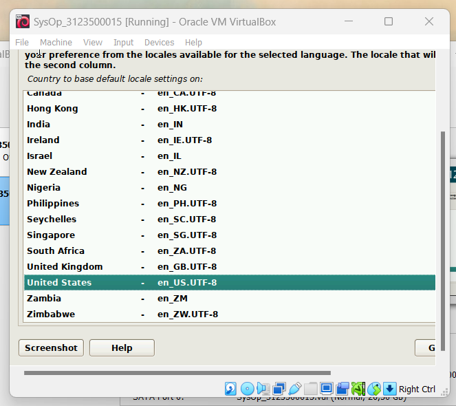]()

1) Setelah halaman VirtualBox terbuka, pilih new

1) Setelah halaman VirtualBox terbuka, pilih new
[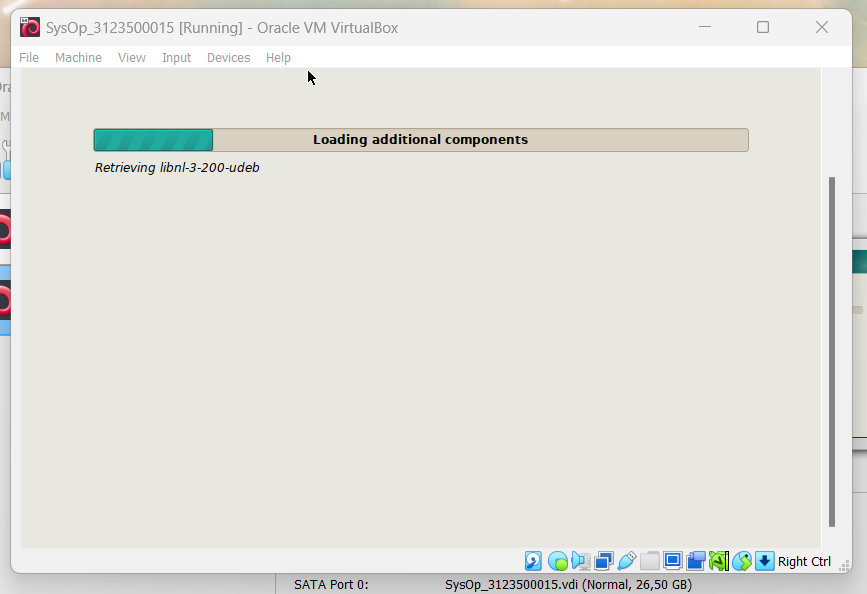]()

1) Setelah halaman VirtualBox terbuka, pilih new

1) Setelah halaman VirtualBox terbuka, pilih new
[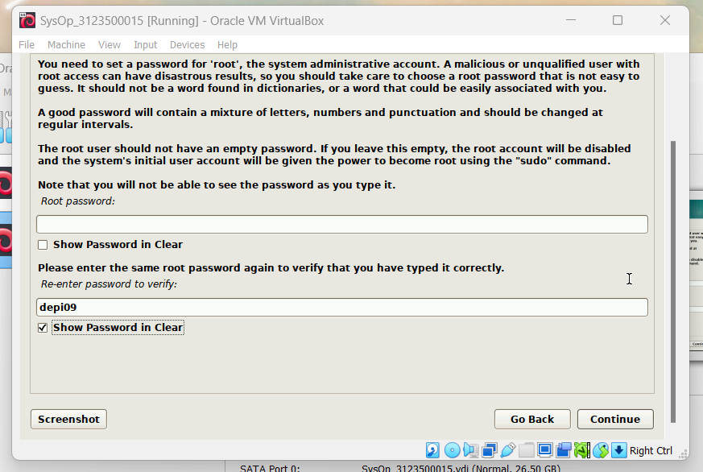]()

1) Setelah halaman VirtualBox terbuka, pilih new

1) Setelah halaman VirtualBox terbuka, pilih new

1) Setelah halaman VirtualBox terbuka, pilih new

1) Setelah halaman VirtualBox terbuka, pilih new
GANTI IMAGE

1) Setelah halaman VirtualBox terbuka, pilih new
[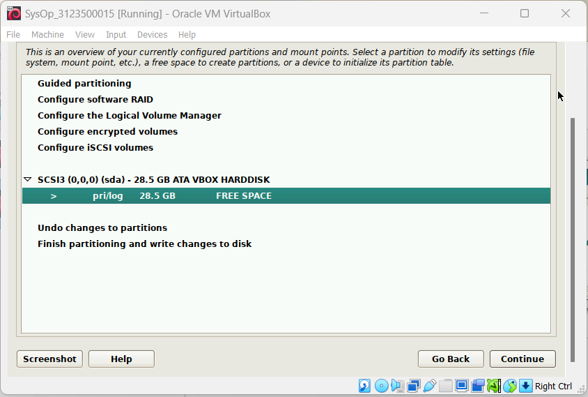]()

1) Setelah halaman VirtualBox terbuka, pilih new

1) Setelah halaman VirtualBox terbuka, pilih new
[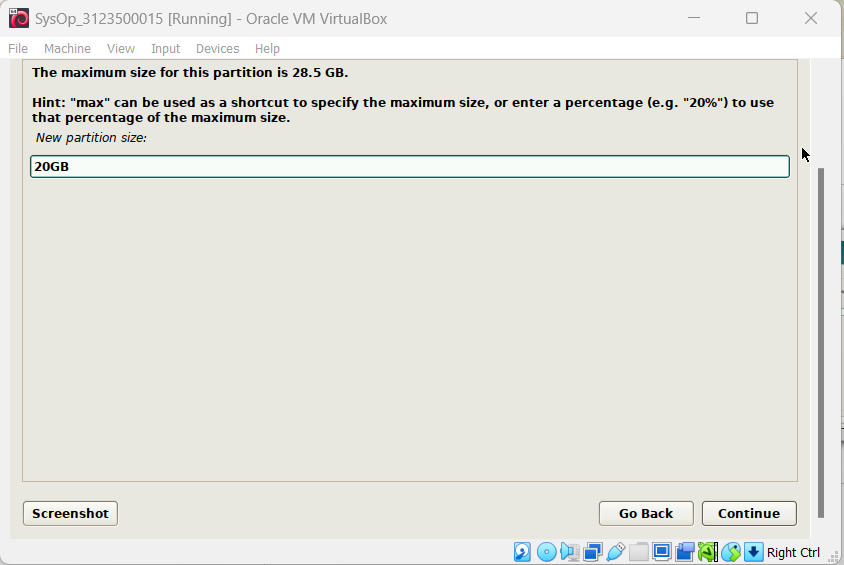]()

1) Setelah halaman VirtualBox terbuka, pilih new

1) Setelah halaman VirtualBox terbuka, pilih new

1) Setelah halaman VirtualBox terbuka, pilih new
[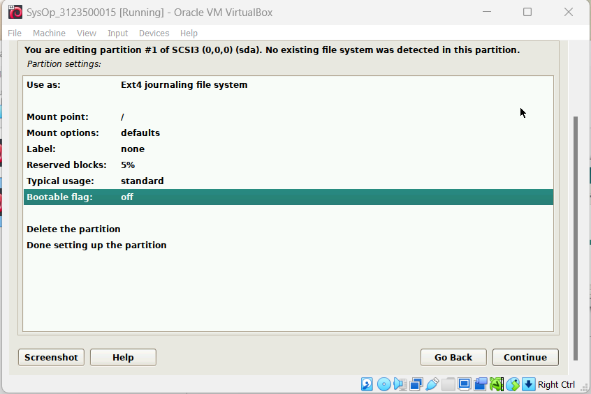]()

1) Setelah halaman VirtualBox terbuka, pilih new

1) Setelah halaman VirtualBox terbuka, pilih new
[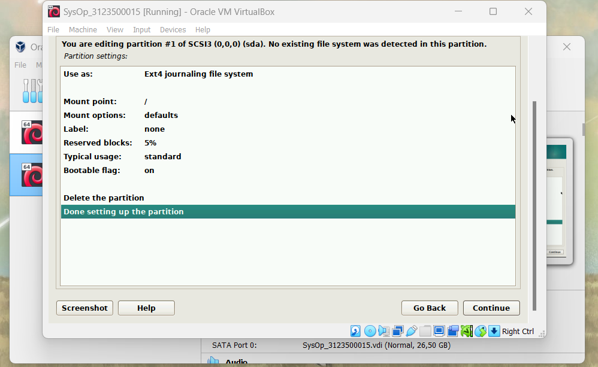]()

1) Setelah halaman VirtualBox terbuka, pilih new
[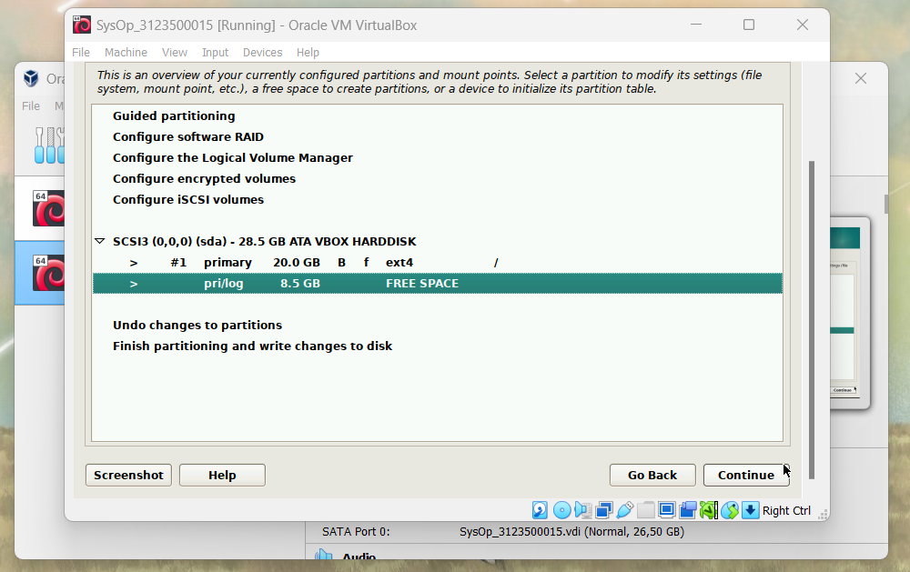]()

1) Setelah halaman VirtualBox terbuka, pilih new
[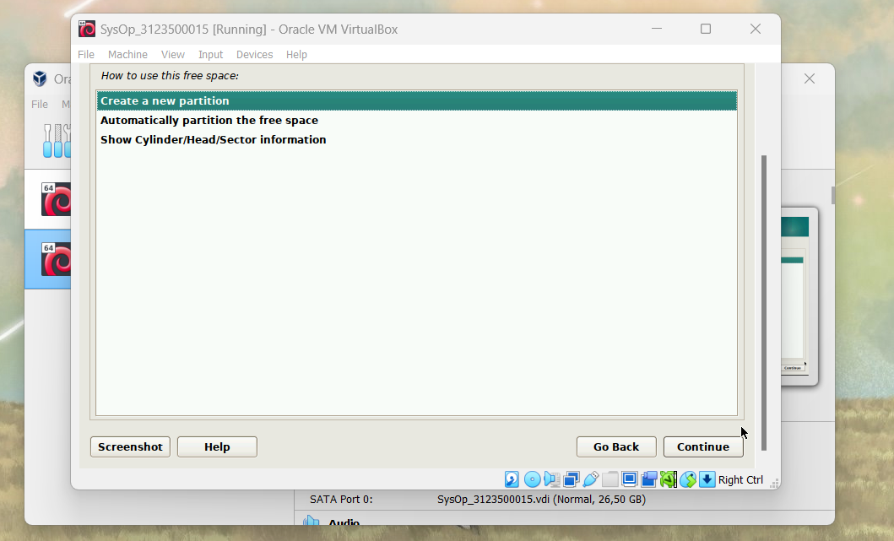]()

1) Setelah halaman VirtualBox terbuka, pilih new

1) Setelah halaman VirtualBox terbuka, pilih new

1) Setelah halaman VirtualBox terbuka, pilih new

1) Setelah halaman VirtualBox terbuka, pilih new

1) Setelah halaman VirtualBox terbuka, pilih new

1) Setelah halaman VirtualBox terbuka, pilih new

1) Setelah halaman VirtualBox terbuka, pilih new

1) Setelah halaman VirtualBox terbuka, pilih new
[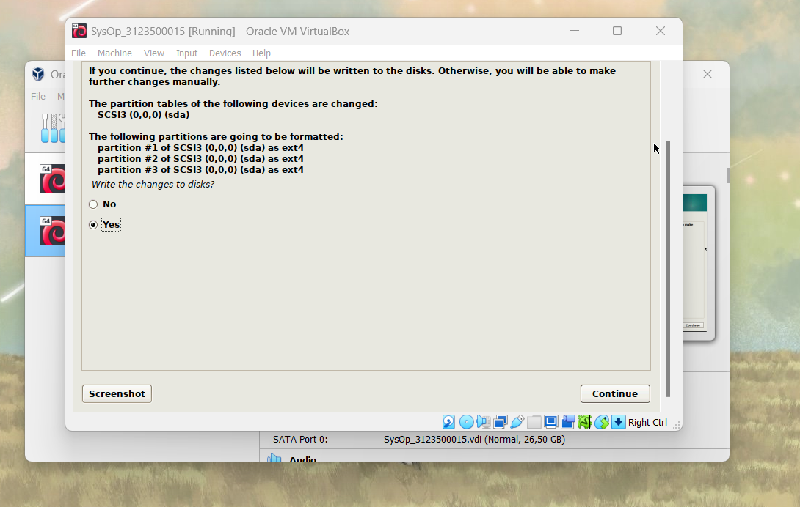]()

1) Setelah halaman VirtualBox terbuka, pilih new
sdsdsd

1) Setelah halaman VirtualBox terbuka, pilih new

1) Setelah halaman VirtualBox terbuka, pilih new

1) Setelah halaman VirtualBox terbuka, pilih new

1) Setelah halaman VirtualBox terbuka, pilih new
[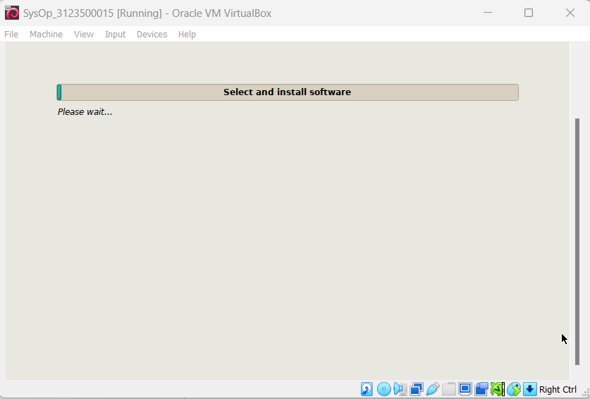]()

1) Setelah halaman VirtualBox terbuka, pilih new

1) Setelah halaman VirtualBox terbuka, pilih new
[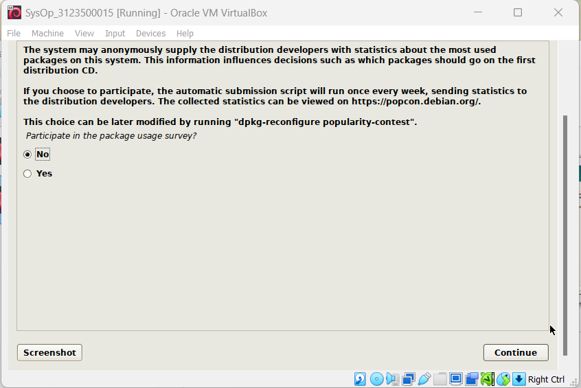]()

1) Setelah halaman VirtualBox terbuka, pilih new

1) Setelah halaman VirtualBox terbuka, pilih new

1) Setelah halaman VirtualBox terbuka, pilih new

1) Setelah halaman VirtualBox terbuka, pilih new
[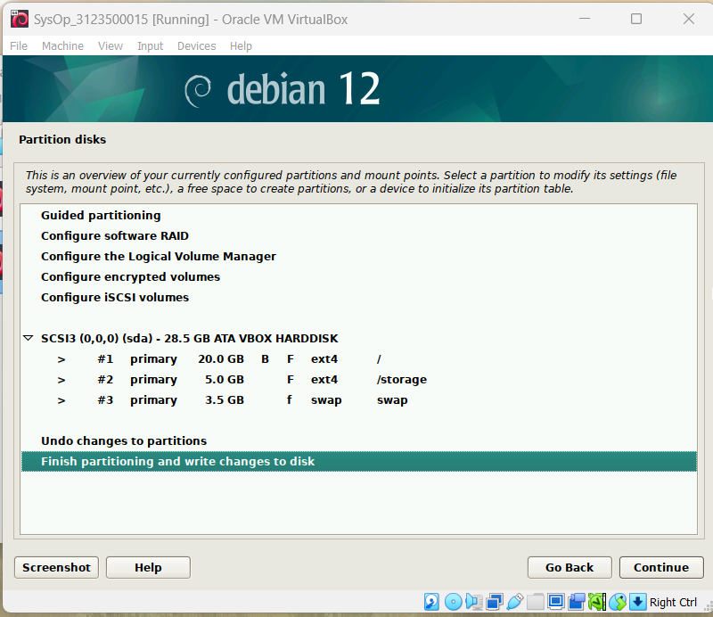]()

    
 

    

