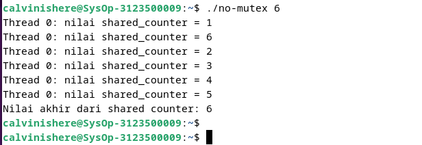
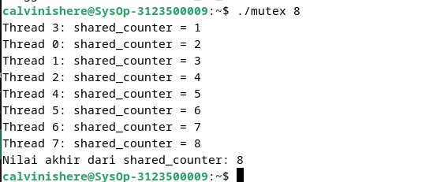

  <h1 style="text-align: center;font-weight: bold">Praktek   Sistem Operasi</h1>
  <h4 style="text-align: center;">Dosen Pengampu : Dr. Ferry Astika Saputra, S.T., M.Sc.</h4>

 

  
  <h3 style="text-align: center;">Disusun Oleh :</h3>
  

    <strong>Calvin Raditya Sandy Winarto (3123500009)</strong> 
    <strong>Zada Devi Mariama (3123500015)</strong>
  

<h3 style="text-align: center;line-height: 1.5">Politeknik Elektronika Negeri Surabaya Departemen Teknik Informatika Dan Komputer Program Studi Teknik Informatika 2024/2025</h3>
  

# Analisa Soal 2

### Program Tanpa Mutex
 
Analisa
- Dalam contoh program diatas variabel global `shared_counter` diakses dan dimodifikasi oleh semua thread tanpa mekanisme penguncian (Mutex), yang menyebabkan kondisi `race condition`. Akibatnya, fungsi `pthread_create` digunakan untuk membuat thread baru. `Race condition` terjadi ketika beberapa `thread` mencoba mengakses dan mengubah `shared_counter` secara bersamaan, menyebabkan hasil akhir yang tidak konsisten. Misalnya, dua thread dapat membaca nilai yang sama dari `shared_counter` sebelum salah satunya menambahkannya.

### Program Dengan Mutex
 
Analisa
- Fungsi `thread_function` dijalankan oleh setiap thread yang dibuat. Setiap thread menerima ID thread sebagai argumen, yang dikonversi dari `void*` ke `long`. Di dalam fungsi, mutex dikunci dengan `pthread_mutex_lock(&shared_counter_mutex)`, yang memastikan hanya satu thread yang dapat mengakses `shared_counter` pada satu waktu. `shared_counter` ditingkatkan nilainya, kemudian nilai `shared_counter` dicetak ke layar bersama dengan ID thread. Setelah selesai, mutex dibuka dengan `pthread_mutex_unlock(&shared_counter_mutex)`, memungkinkan thread lain untuk mengunci dan mengakses `shared_counter`.

## Kesimpulan
- Program pertama tanpa menggunakan mutex untuk melindungi variabel global `shared_counter`. Karena tidak ada penguncian, program ini rentan terhadap kondisi `race condition`, di mana beberapa thread dapat mengakses dan memodifikasi `shared_counter` secara bersamaan tanpa koordinasi. Program kedua menggunakan mutex untuk melindungi akses ke variabel global `shared_counter`.
Dengan menggunakan mutex, akses ke `shared_counter` diatur sehingga hanya satu thread yang dapat mengakses dan memodifikasinya pada satu waktu. Penggunaan mutex memastikan koordinasi antara thread, menghindari race condition dan memastikan hasil akhir yang konsisten.

