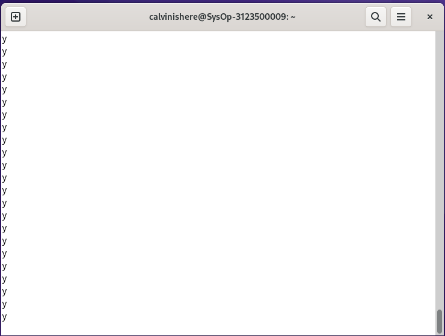

<div align="center">
  <h1 style="text-align: center;font-weight: bold">Praktikum 6<br>Praktek Sistem Operasi</h1>
  <h4 style="text-align: center;">Dosen Pengampu : Dr. Ferry Astika Saputra, S.T., M.Sc.</h4>
</div>
<br />
<div align="center">
  
  <h3 style="text-align: center;">Disusun Oleh :</h3>
  <p style="text-align: center;">
    <strong>Calvin Raditya Sandy Winarto (3123500009)</strong><br>
    <strong>Zada Devi Mariama (3123500015)</strong><br>
  </p>

<h3 style="text-align: center;line-height: 1.5">Politeknik Elektronika Negeri Surabaya<br>Departemen Teknik Informatika Dan Komputer<br>Program Studi Teknik Informatika<br>2024/2025</h3>
  <hr>
</div>

# Proses dan Manajemen Proses

### POKOK BAHASAN

    ✓ Proses pada Sistem Operasi Linux
    ✓ Manajemen Proses pada Sistem Operasi Linux

### TUJUAN BELAJAR

Setelah mempelajari materi dalam bab ini, mahasiswa diharapkan mampu:

    ✓ Memahami konsep proses pada sistem operasi Linux.
    ✓ Menampilkan beberapa cara menampilkan hubungan proses parent dan child.
    ✓ Menampilkan status proses dengan beberapa format berbeda.
    ✓ Melakukan pengontrolan proses pada shell.
    ✓ Memahami penjadwalan prioritas.

## DASAR TEORI

#### 1. KONSEP PROSES PADA SISTEM OPERASI LINUX

Proses adalah program yang sedang dieksekusi. Setiap kali menggunakan utilitas sistem atau program aplikasi dari shell, satu atau lebih proses ”child” akan dibuat oleh shell sesuai perintah yang diberikan. Setiap kali instruksi dibe rikan pada Linux shell, maka kernel akan menciptakan sebuah proses-id. Proses ini disebut juga dengan terminology Unix sebagai sebuah Job. Proses Id (PID) dimulai dari 0, yaitu proses INIT, kemudian diikuti oleh proses berikutnya (terdaftar pada /etc/inittab).
Beberapa tipe proses :

- Foreground
    - Proses yang diciptakan oleh pemakai langsung pada terminal (interaktif, dialog)
- Batch
    - Proses yang dikumpulkan dan dijalankan secara sekuensial (sa  u persatu). Prose Batch tidak diasosiasikan (berinteraksi) dengan terminal.
- Daemon
    - Proses yang menunggu permintaan (request) dari proses lainnya dan menjalankan tugas sesuai dengan permintaan tersebut. Bila tidak ada request, maka program ini akan berada dalam kondisi “idle” dan tidak menggunakan waktu hitung CPU. Umumnya nama proses daemon di UNIX berakhiran d, misalnya inetd, named, popd dll

#### 2. SINYAL

Proses dapat mengirim dan menerima sinyal dari dan ke proses lainnya. Proses mengirim sinyal melalui instruksi “kill” dengan format.

    kill [-nomor sinyal] PID

Nomor sinyal : 1 s/d maksimum nomor sinyal yang didefinisikan system Standar nomor sinyal yang terpenting adalah :

| No Sinyal | Nama    | Deskripsi                                                                             |
| --------- | ------- | ------------------------------------------------------------------------------------- |
| 1         | SIGHUP  | Hangup, sinyal dikirim bila proses terputus, misalnya melalui putusnya hubungan modem |
| 2         | SIGINT  | Sinyal interrupt, melalui ^C                                                          |
| 3         | SIGQUIT | Sinyal Quit, melalui ^\                                                          |                                                                           |
| 9         | SIGKILL | Sinyal Kill, menghentikan proses                                                      |
| 15        | SIGTERM | Sinyal terminasi software                                                    |

#### 3. MENGIRIM SINYAL

Mengirim sinyal adalah satu alat komunikasi antar proses yaitu memberitahukan proses yang sedang berjalan bahwa ada sesuatu yang harus dikendalikan. Berdasarkan sinyal yang dikirim ini maka proses dapat bereaksi dan administrator/programmer dapat menentukan reaksi tersebut. Mengirim sinyal menggunakan instruksi

    kill [-nomor sinyal] PID

Sebelum mengirim sinyal PID proses yang akan dikirim harus diketahui terlebih dahulu.

#### 4. MENGONTROL PROSES PADA SHELL

Shell menyediakan fasilitas job control yang memungkinkan mengontrol beberapa job atau proses yang sedang berjalan pada waktu yang sama. Misalnya bila melakukan pengeditan file teks dan ingin melakukan interrupt pengeditan untuk mengerjakan hal lainnya. Bila selesai, dapat kembali (switch) ke editor dan melakukan pengeditan file teks kembali.</br>
Job bekerja pada <strong>foreground</strong> atau <strong>background</strong>. Pada foreground hanya diper untukkan untuk satu job pada satu waktu. Job pada foreground akan mengontrol shell - menerima input dari keyboard dan mengirim output ke layar. Job pada background tidak menerima input dari terminal, biasanya berjalan tanpa memerlukan interaksi</br>
Job pada foreground kemungkinan dihentikan sementara (suspend), dengan menekan [Ctrl-Z]. Job yang dihentikan sementara dapat dijalankan kembali pada foreground atau background sesuai keperluan dengan menekan <strong>”fg”</strong> atau <strong>”bg”</strong>. Sebagai catatan, menghentikan job seme ntara sangat berbeda dengan melakuakan interrupt job (biasanya menggunakan [Ctrl-C]), dimana job yang diinterrup akan dimatikan secara permanen dan tidak dapat dijalankan lagi.

#### 5. MENGONTROL PROSES LAIN

Perintah ps dapat digunakan untuk menunjukkan semua proses yang sedang berjalan pada mesin (bukan hanya proses pada shell saat ini) dengan format :

    ps –fae atau
    ps -aux

Beberapa versi UNIX mempunyai utilitas sistem yang disebut top yang menyediakan cara interaktif untuk memonitor aktifitas sistem. Statistik secara detail dengan proses yang berjalan ditampilkan dan secara terus-menerus di-refresh . Proses ditampilkan secara terurut dari utilitas CPU. Kunci yang berguna pada top adalah

    s – set update frequency
    u – display proses dari satu user
    k – kill proses (dengan PID)
    q – quit

Utilitas untuk melakukan pengontrolan proses dapat ditemukan pada sistem UNIX adalah perintah killall. Perintah ini akan menghentikan proses sesuai PID atau job number proses.

## Percobaan 1 (Menghentikan dan memulai Job)
1. Cara lain meletakkan job pada _background_ dengan memulai job secara normal (pada _foreground_), __stop__ job dan memulai lagi pada _background_
`$ yes > /dev/null`
Hentikan sementara job (_suspend_), bukan menghentikannya (_terminate_), tetapi menghentikan sementara job sampai di restart. Untuk menghentikan sementara job gunakan __Ctrl-Z__.

   
   Dihentikan sementara menggunakan perintah __Ctrl-Z__
   

2. Untuk restart job pada _foreground_, gunakan perintah `fg`.
    ```
    $ fg
    ```
   

3. Shell akan menampilkan nama perintah yang diletakkan di _foreground_. Stop
job lagi dengan __Ctrl-Z__. Kemudian gunakan perintah `bg` untuk meletakkan job pada _background_.
    ```
    $ bg
    ```
   

    Job tidak bisa dihentikan dengan __Ctrl-Z__ karena job berada pada _background_.
    Untuk menghentikannya, letakkan job pada _foreground_ dengan `fg` dan kemudian hentikan sementara dengan __Ctrl-Z__.
    ```
    $ fg
    ```
   

4. Job pada _background_ dapat digunakan untuk menampilkan teks pada terminal, dimana dapat diabaikan jika mencoba mengerjakan job lain.
    ```
    $ yes &
    ```
   

    Untuk menghentikannya tidak dapat menggunakan __Ctrl-C__. Job harus dipindah ke _foreground_, baru dihentikan dengan cara tekan `fg` dan tekan Enter, kemudian dilanjutkan dengan __Ctrl-Z__ untuk menghentikan sementara.

5. Apabila ingin menjalankan banyak job dalam satu waktu, letakkan job pada
_foreground_ atau _background_ dengan memberikan job ID
    ```
    $ fg %2
    $ bg %2 atau $ %2
    ```
   
   

6. Tekan `fg` dan tekan __Enter__, kemudian dilanjutkan dengan __Ctrl-Z__ untuk menghentikan sementara.
   

7. Lihat job dengan perintah `ps -fae` dan tekan __Enter__. Kemudian hentikan proses dengan perintah kill.
    ```
    $ ps -fae
    $ kill -9 <NomorPID>
    ```
   
   


## Percobaan 2 (Percobaan dengan Penjadwalan Prioritas)

1.	Login sebagai root.
    ```
    $ su
    ```
    
2.	Buka 3 terminal, tampilkan pada screen yang sama.
    
3.	Pada setiap terminal, ketik __PS1 = ” \w:”__ diikuti __Enter__. \w menampilkan path pada direktori home.
    
4.	Karena login sebagai root, maka akan ditampilkan ~: pada setiap terminal. Untuk setiap terminal ketik __pwd__ dan tekan __Enter__ untuk melihat bahwa Anda sedang berada pada direktori/root.
    
5.	Buka terminal lagi (keempat), atur posisi sehingga keempat terminal terlihat
pada screen.
    
6.	Pada terminal keempat, ketik __top__ dan tekan __Enter__. Maka program `top` akan muncul. Ketik __i__. __Top__ akan menampilkan proses yang aktif. Ketik __lmt. Top__ tidak lagi menampilkan informasi pada bagian atas dari screen. Pada percobaan ini, terminal ke empat sebagai jendela __Top__.
    
7.	Pada terminal 1, bukalah program executable C++ dengan mengetik program
__yes__ dan tekan __Enter__.
    
8.	Ulangi langkah 7 untuk terminal 2.
    
9.	Jendela __Top__ akan menampilkan dua program yes sebagai proses yang berjalan. Nilai %CPU sama pada keduanya. Hal ini berarti kedua proses mengkonsumsi waktu proses yang sama dan berjalan sama cepat. PID dari kedua proses akan berbeda, misalnya 3148 dan 3149. Kemudian gunakan terminal 3 (yang tidak menjalankan `primes` maupun Jendela __Top__) dan ketik renice 19 <PID terimnal 1> (contoh : __renice 19 3148__) dan dikuti Enter. Hal ini berarti mengganti penjadwalan prioritas dari proses ke 19.
    
10.	Tunggu beberapa saat sampai program __top__ berubah dan terlihat pada jendela
Top. Pada kolom STAT memperlihatkan N untuk proses 3148. Hal ini berarti bahwa penjadwalan prioritas untuk proses 3148 lebih besar (lebih lambat) dari 0. Proses 3149 berjalan lebih cepat.
    
11.	Program `top` juga mempunyai fungsi yang sama dengan program renice. Pilih Jendela __Top__ dan tekan __r__. Program `top` terdapat prompt __PID to renice__: tekan __3148__ (ingat bahwa Anda harus mengganti 3148 dengan PID Anda sendiri) dan tekan __Enter__. Program top memberikan prompt __Renice PID 3148 to value__: tekan __-19__ dan tekan __Enter__.
    ```
    Memilih proses 3657
    ```
    
    ```
    Setelah memilih proses 3657 maka tekan -19 lalu Enter
    ```
    
12.	Tunggu beberapa saat sampai top berubah dan lihat nilai %CPU pada kedua proses. Sekarang proses 3148 lebih cepat dari proses 3149. Kolom status menunjukkan < pada proses 3148 yang menunjukkan penjadwalan
prioritas lebih rendah (lebih cepat) dari nilai 0.
    
13.	Pilih terminal 3 (yang sedang tidak menjalankan yes atau program top) dan ketik __nice –n -10 yes__ dan tekan __Enter__. Tunggu beberapa saat agar
program `top` berubah dan akan terlihat proses primes ketiga. Misalnya PID nya 4107. Opsi -10 berada pada kolom NI (penjadwalan prioritas).
    
    
14.	Jangan menggunakan mouse dan keyboard selama 10 detik. Program `top` menampilkan proses yang aktif selain program `yes`. Maka akan terlihat proses `top` terdaftar tetapi %CPU kecil (dibawah 1.0) dan konsisten. Juga terlihat proses berhubungan dengan dekstop grafis seperti X, panel dll.
    
15.	Pindahkan mouse sehingga kursor berubah pada screen dan lihat apa yang
terjadi dengan tampilan top. Proses tambahan akan muncul dan nilai
%CPU berubah sebagai bagian grafis yang bekerja. Satu alasan adalah bahwa proses 4107 berjalan pada penjadwalan prioritas tinggi. Pilih jendela __Top__, ketik __r. PID to renice__: muncul prompt. Ketik __4107__ (ubahlah 4107 dengan PID Anda) dan tekan __Enter__. __Renice PID 4107 to value__: muncul prompt. Ketik __0__ dan tekan __Enter__. Sekarang pindahkan mouse ke sekeliling screen. Lihat perubahannya.
    ```
    Memilih PID
    ```
    
16.	Tutup semua terminal window.
    

