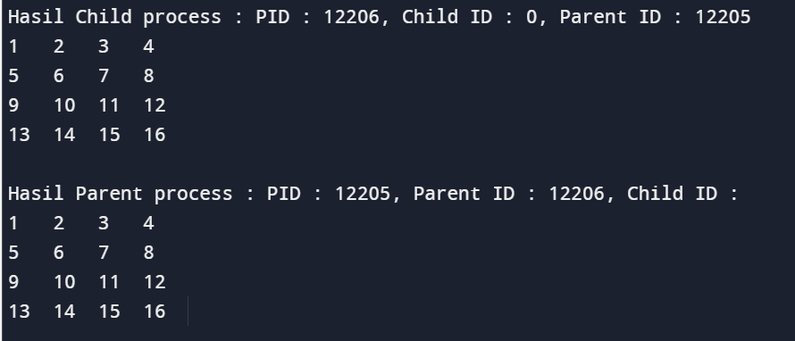

<div align="center">
  <h1 style="text-align: center;font-weight: bold">Praktikum 6<br>Proses Fork Multithread</h1>
  <h4 style="text-align: center;">Dosen Pengampu : Dr. Ferry Astika Saputra, S.T., M.Sc.</h4>
</div>
<br />
<div align="center">
  
  <h3 style="text-align: center;">Disusun Oleh : </h3>
  <p style="text-align: center;">
    <strong>Calvin Raditya Sandy Winarto - 3123500009</strong>
  </p>
<h3 style="text-align: center;line-height: 1.5">Politeknik Elektronika Negeri Surabaya<br>Departemen Teknik Informatika Dan Komputer<br>Program Studi Teknik Informatika<br>2023/2024</h3>
  <hr><hr>
</div>

## Daftar Isi
1. [Dasar teori](#dasar-teori)
2. [Tugas](#tugas)
    - [Tugas Percobaan 5](#percobaan-5-menghentikan-dan-memulai-kembali-job)
    - [Tugas Percobaan 6](#percobaan-6-percobaan-dengan-penjadwalan-prioritas)
    - [Tugas Latihan](#latihan)
3. [Kesimpulan](#kesimpulan)

# Process - Fork - Multithread
Setiap program atau bagian dari program yang sedang dieksekusi oleh CPU disebut dengan proses. Proses dapat berjalan secara _foreground_ atau _background_.

Untuk melihat seluruh proses yang sedang berjalan gunakan perintah `$ ps -e` .
Bisa juga menggunakan perintah `$pstree | more` untuk melihat secara detil proses yang sefan berjalan dengan format **tree**.

Setiap proses akan memilik **PID**  Process ID). Apabila dibutuhkan Sebuah proses bisa memiliki proses anakan. Dalam hubungan tersebut proses dapat diibaratkan seperti orang tua (_parent_) dengan anak (_child_) yang turun temurun.
- Setiap proses memiliki parent dan child.
- Setiap proses memiliki ID (_pid_) dan parent ID (_ppid_), kecuali proses `init` atau `systemd`.
- _ppid_ dari sebuah proses adalah ID dari parent proses tersebut.

```mermaid
classDiagram
      Parent_Process --|> Child_Process
      Parent_Process : PID =4900
      Parent_Process : PPID = 4
      Parent_Process: bash
      class Child_Process{
          PID=4901
          PPID = 4900
          fork01
      }
   ```

   Perhatikan, ppid dari proses `fork01` adalah pid dari proses `bash`.

**fork** digunakan untuk menduplikasi proses. Proses yang baru disebut dengan child proses, sedangkan proses pemanggil disebut dengan parent proses. Spesifikasi fork bisa dilihat dengan `$ man 2 fork`.
```
int main() {
                            pid: 2308, ppid: 10
                             [Main process]
                                 |
  fork();              > Child process created <
                                 +
                               /   \
                             /       \
               pid: 2308, ppid: 10    pid: 30, ppid: 2308
                [Parent Process]    [Child Process]

  return 0;
}
```
perhatikan bahwa :
- `pid` Parent Process == `ppid` Child
- `child_id` Parent Process == `pid` Child Process

**Exec** adalah function yang digunakan untuk menjalankan program baru dan mengganti program yang sedang berlangsung. `exec` adalah program family yang memiliki berbagai fungsi variasi, yaitu `execvp`, `execlp`, `execv`, dan lain lain.

**wait** adalah function yang digunakan untuk mendapatkan informasi ketika child proses berganti _state_-nya. Pergantian state dapat berupa _termination_, _resume_, atau _stop_.

Manual: `$ man 3 exec`

## 1. Fork : Parent - Child Process
- Buat tulisan tentang konsep **fork**  dan implementasinya dengan menggunakan bahasa pemrograman C! (minimal 2 paragraf disertai dengan gambar)

**JAWAB**

### Konsep `fork` dalam Bahasa Pemrograman C

Dalam bahasa pemrograman C, `fork()` adalah sebuah _sistem panggilan_ `(system call)` yang digunakan untuk membuat proses baru _(child process)_ dari proses yang sudah ada _(parent process)_. Proses baru ini memiliki salinan dari lingkungan proses induknya. Dengan kata lain, `fork()` menciptakan duplikat dari proses pemanggil sehingga kedua proses, yaitu proses induk dan proses anak, memiliki konteks memori yang terpisah dan mulai berjalan secara independen setelah pemanggilan `fork()`.\

  Contoh Penggunaan Fork() dalam bahasa C
  ```
  #include <sys/types.h>
  #include <unistd.h>
  #include <stdio.h>

  int main()
  {
  pid_t child_id;
  printf("This is the main program, with PID = %d, Child's ID = %d, Parent ID = %d\n",
  (int) getpid(), (int) child_id, (int) getppid());

      child_id = fork();
      if(child_id != 0){
        printf("This is the parent process, with PID = %d, Child's ID = %d, Parent ID = %d\n",
        (int) getpid(), (int) child_id, (int) getppid());
      } else {
        printf("This is the child process, with PID = %d, Child's ID = %d, Parent ID = %d\n",
        (int) getpid(), (int) child_id, (int) getppid());
      }
  }
  ```

Dalam contoh di atas:

- `fork()` digunakan untuk membuat proses baru. Setelah pemanggilan `fork()`, dua proses akan berjalan secara paralel.
- Jika nilai yang dikembalikan oleh `fork()` adalah 0, itu berarti proses tersebut adalah proses anak _(Child Process)_.
- Jika nilai yang dikembalikan oleh `fork()` lebih besar dari 0, itu berarti proses tersebut adalah proses induk _(Parent Process)_. Nilai yang dikembalikan adalah __PID__ dari proses anak _(Child Process)_.
- Jika terjadi kesalahan saat memanggil `fork()`, nilai yang dikembalikan akan kurang dari 0, dan pesan kesalahan akan dicetak.

Dengan menggunakan `fork()`, program dapat membuat proses baru untuk menjalankan tugas-tugas tertentu secara paralel, meningkatkan kinerja dan efisiensi program.

- Akses dan clonning repo : https://github.com/ferryastika/operatingsystem.git

- Deskripsikan dan visualisasikan pohon proses hasil eksekusi dari kode program `fork01.c`, `fork02.c`, `fork03.c`, `fork04.c`, `fork05.c`dan `fork06.c`.

**JAWAB**
  ```
  #include <sys/types.h>
  #include <unistd.h>
  #include <stdio.h>

  int main()
  {
  pid_t child_id;
  printf("This is the main program, with PID = %d, Child's ID = %d, Parent ID = %d\n",
  (int) getpid(), (int) child_id, (int) getppid());

      child_id = fork();
      if(child_id != 0){
        printf("This is the parent process, with PID = %d, Child's ID = %d, Parent ID = %d\n",
        (int) getpid(), (int) child_id, (int) getppid());
      } else {
        printf("This is the child process, with PID = %d, Child's ID = %d, Parent ID = %d\n",
        (int) getpid(), (int) child_id, (int) getppid());
      }
  }
  ```
  
- Program diatas mencetak PID, Child ID, dan PPID (Parent Process ID) pada main program dipanggil PID yang tertera 4285 dan parent ID 4285. Main program lalu menggunakan fungsi fork() lalu ditampilkan dengan keterangan parent process dan child process.

## **fork01**
  ```
  using namespace std;

  #include <iostream>
  #include <sys/types.h>
  #include <unistd.h>


  /* getpid() adalah system call yg dideklarasikan pada unistd.h.
  Menghasilkan suatu nilai dengan type pid_t.
  pid_t adalah type khusus untuk process id yg ekuivalen dg int
  */
  int main(void) {
    pid_t mypid;
    uid_t myuid;
    for (int i = 0; i < 3; i++) {
      mypid = getpid();
      cout << "I am process " << mypid << endl;
      cout << "My parent process ID is " << getppid() << endl;
      cout << "The owner of this process has uid " << getuid()
    << endl;
  /* sleep adalah system call atau fungsi library
  yang menghentikan proses ini dalam detik
  */
    sleep(3);
    }
  return 0;
  }
  ```
  
  - pid_t mypid: Menyimpan ID proses.
  - uid_t myuid: Menyimpan ID user pemilik proses.
  - Looping
    - Looping for diulang 3 kali.
    - Di setiap iterasi
      - Mendapatkan ID proses dengan mypid = getpid().
      - Mencetak ID proses dan ID proses parentnya dengan cout.
      - Mendapatkan ID user pemilik proses dengan myuid = getuid().
      - Mencetak ID user pemilik proses dengan cout.
      - Menunggu 3 detik dengan sleep(3).

  Visualisasi fork01
  ```
    int main() {
    for(int i = 0; i < 3; i++) {
                            [Main Process]
                                  |
                                  v
                                sleep(3)
                                  |
                                  v
                            [Main Process]
                                  |
                                  v
                                sleep(3)
                                  |
                                  v
                            [Main Process]
                                  |
                                  v
                                sleep(3)
      }
    return 0;
  }
  ```

## **fork02**
  ```
  #include <iostream>
  #include <sys/types.h>
  #include <unistd.h>
  using namespace std;


  /* getpid() dan fork() adalah system call yg dideklarasikan
  pada unistd.h.
  Menghasilkan suatu nilai dengan type pid_t.
  pid_t adalah type khusus untuk process id yg ekuivalen dg int
  */
  int main(void) {
    pid_t childpid;
    int x = 5;
    childpid = fork();

    while (1) {
      cout << "This is process ID" << getpid() << endl;
      cout << "In this process the value of x becomes " << x << endl;
      sleep(2);
      x++;
    }
    return 0;
  }
  ```

  
  - pid_t childpid: Menyimpan ID proses child.
  - int x = 5: Variabel global x diinisialisasi dengan nilai 5.
  - Fork dan Looping Infinite:
    - childpid = fork();: Membuat proses child baru.
    - while(1): Looping infinite yang terus berjalan.

  ```
  int main() {
  fork();           Child process created
                              |
                              v
                      -----------------
                      |               |
                      |               |
  while(1){           |               |
            [Parent Process]    [Child Process]
                      \               /
                        \           /
                          \       /
                            \   /
                              |
                              v
                          sleep(2)
                              |
                              v
                             x++
    }
  }
  ```
## **fork03**
  ```
  using namespace std;

  #include <iostream>
  #include <sys/types.h>
  #include <unistd.h>

  /* getpid() dan fork() adalah system call yg dideklarasikan
  pada unistd.h.
  Menghasilkan suatu nilai dengan type pid_t.
  pid_t adalah type khusus untuk process id yg ekuivalen dg int
  */
  int main(void) {
    pid_t childpid;
    childpid = fork();
    for (int i = 0; i < 5; i++) {
      cout << "This is process " << getpid() << endl;
      sleep(2);
    }
    return 0;
  }
  ```

  
  - pid_t childpid: Menyimpan ID proses child.
    - childpid = fork();: Membuat proses child baru.
    - childpid == 0: Kode dalam loop for dieksekusi oleh proses child.
    - childpid > 0: Kode dalam loop for dieksekusi oleh proses parent.
  - Looping
    - Looping for diulang 5 kali.
    - Di setiap iterasi:
      - Mencetak "This is process ..." dengan ID prosesnya.
      - Menunggu 2 detik dengan sleep(2).

  ```
  int main() {
    fork();
                child process created
                            |
                            v
              ----------------------------
              |                           |
              |                           |
              v                           v
        parent Process             Child Process
              |                           |
              |                           |
              v                           v
              wait -----> sleep(2) ----> exit
  }
  ```


## **fork04**
  ```
  using namespace std;

  #include <iostream>
  #include <sys/types.h>
  #include <unistd.h>
  #include <sys/wait.h>
  /* pid_t fork() dideklarasikan pada unistd.h.
  pid_t adalah type khusus untuk process id yg ekuivalen dg int
  */

  int main(void) {
    pid_t child_pid;
    int status;
    pid_t wait_result;
    child_pid = fork();
    if (child_pid == 0) {
      /* kode ini hanya dieksekusi proses child */
      cout << "I am a child and my pid = " << getpid() << endl;
      cout << "My parent is " << getppid() << endl;
      /* keluar if akan menghentikan hanya proses child */
    }
    else if (child_pid > 0) {
      /* kode ini hanya mengeksekusi proses parent */
      cout << "I am the parent and my pid = " << getpid() << endl;
      cout << "My child has pid = " << child_pid << endl;
    }
    else {
      cout << "The fork system call failed to create a new process" << endl;
      exit(1);
    }
      /* kode ini dieksekusi baik oleh proses parent dan child */
      cout << "I am a happy, healthy process and my pid = " << getpid() << endl;
      if (child_pid == 0) {
      /* kode ini hanya dieksekusi oleh proses child */
      cout << "I am a child and I am quitting work now!"<< endl;
    }
    else {
      /* kode ini hanya dieksekusi oleh proses parent */
      cout << "I am a parent and I am going to wait for my child" << endl;
    do {
      /* parent menunggu sinyal SIGCHLD mengirim tanda bahwa proses child diterminasi */
      wait_result = wait(&status);
    } while (wait_result != child_pid);
      cout << "I am a parent and I am quitting." << endl;
    }
    return 0;
  }
  ```

  
  - __child_pid = fork();__ : Membuat proses child baru.
    - child_pid == 0: Kode dalam blok ini dieksekusi oleh proses child.
    - child_pid > 0: Kode dalam blok ini dieksekusi oleh proses parent.
  - __Proses Child__
    - Mencetak "I am a child..." dan ID prosesnya.
    - Mencetak "My parent is ..." dan ID proses parent-nya.
      Keluar dari proses child.
  - __Proses Parent__
    - Mencetak "I am the parent..." dan ID prosesnya.
    - Mencetak "My child has pid ..." dan ID proses child.
    - Mencetak "I am a happy, healthy process..." (dicetak oleh proses parent dan child).
    - Menunggu proses child selesai menggunakan wait().
    - Mencetak "I am a parent and I am quitting."

  ```
    int main() {
      fork();              child process created
                                    |
                                    v
                          ----------------------
                          |                    |
                          |                    |
                          v                    v
                   parent Process       Child Process
                          |                    |
                          |                    |
                          v                    v
                         wait --------------> exit
  }
  ```

## **fork05**
  ```
  using namespace std;

  #include <iostream>
  #include <sys/types.h>
  #include <unistd.h>
  #include <sys/wait.h>
  /* pid_t fork() dideklarasikan pada unistd.h.
  pid_t adalah type khusus untuk process id yg ekuivalen dg int
  */

  int main(void) {
    pid_t child_pid;
    int status;
    pid_t wait_result;
    child_pid = fork();
    if (child_pid == 0) {
      /* kode ini hanya dieksekusi proses child */
      cout << "I am a child and my pid = " << getpid() << endl;
      execl("/bin/ls", "ls", "-l", "/home", NULL);
      /* jika execl berhasil kode ini tidak pernah digunakan */
      cout << "Could not execl file /bin/ls" << endl;
      exit(1);
      /* exit menghentikan hanya proses child */
    }
    else if (child_pid > 0) {
      /* kode ini hanya mengeksekusi proses parent */
    cout << "I am the parent and my pid = " << getpid() << endl;
    cout << "My child has pid = " << child_pid << endl;
    }
    else {
    cout << "The fork system call failed to create a new process" << endl;
    exit(1);
    }
    /* kode ini hanya dieksekusi oleh proses parent karena
    child mengeksekusi dari “/bin/ls” atau keluar */
    cout << "I am a happy, healthy process and my pid = " << getpid() << endl;
    if (child_pid == 0) {
    /* kode ini tidak pernah dieksekusi */
    printf("This code will never be executed!\n");
    }
    else {
    /* kode ini hanya dieksekusi oleh proses parent */
      cout << "I am a parent and I am going to wait for my child" << endl;
      do {
        /* parent menunggu sinyal SIGCHLD mengirim tanda bila proses child diterminasi */
        wait_result = wait(&status);
      } while (wait_result != child_pid);
      cout << "I am a parent and I am quitting." << endl;
    }
    return 0;
  }
  ```
  
  - Baris execl("/bin/ls", "ls", "-l", "/home", NULL);:
    - Menjalankan program /bin/ls (perintah ls) dengan argumen:
      - "ls": Nama program.
      - "-l": Opsi menampilkan detail file.
      - "/home": Direktori yang ingin dilisting.
  - Kode ini mendemonstrasikan penggunaan fork() dan execl() untuk menjalankan program eksternal ls dengan opsi -l pada direktori /home.
  - Proses anak digantikan dengan proses ls yang menampilkan listing detail file di direktori /home.
  - Proses parent menunggu proses anak (ls) selesai menggunakan wait().
  - Keluaran program ini akan menampilkan listing detail file di direktori /home (sesuai dengan argumen ls).
  - Proses parent kemudian mencetak pesan dan program berakhir.

  ```
  int main() {
    fork();           child process created
                                |
                                v
                    --------------------------
                    |                        |
                    v                        v
              parent Process            Child Process
                    |               total 20 execl(/bin/ls)
                    |                        |
                    v                        v
                   wait ------------------> exit
  }
  ```

## **fork06**
  ```
  using namespace std;

  #include <iostream>
  #include <sys/types.h>
  #include <unistd.h>
  #include <sys/wait.h>
  /* pid_t fork() dideklarasikan pada unistd.h.
  pid_t adalah type khusus untuk process id yg ekuivalen dg int
  */

  int main(void) {
    pid_t child_pid;
    int status;
    pid_t wait_result;
    child_pid = fork();


    if (child_pid == 0) {
      /* kode ini hanya dieksekusi proses child */
      cout << "I am a child and my pid = " << getpid() << endl;
      execl("fork03", "goose", NULL);
      /* jika execl berhasil kode ini tidak pernah digunakan */
      cout << "Could not execl file fork3" << endl;
      exit(1);
      /* exit menghentikan hanya proses child */
    }
    else if (child_pid > 0) {
      /* kode ini hanya mengeksekusi proses parent */
      cout << "I am the parent and my pid = " << getpid()<< endl;
      cout << "My child has pid = " << child_pid << endl;
    }
    else {
      cout << "The fork system call failed to create a new process" << endl;
      exit(1);
    }
    /* kode ini hanya dieksekusi oleh proses parent karena
    child mengeksekusi dari “fork3” atau keluar */
      cout << "I am a happy, healthy process and my pid = " << getpid() << endl;
      if (child_pid == 0) {
    /* kode ini tidak pernah dieksekusi */
      printf("This code will never be executed!\n");
    }
    else {
    /* kode ini hanya dieksekusi oleh proses parent */
      cout << "I am a parent and I am going to wait for my child" << endl;
      do {
      /* parent menunggu sinyal SIGCHLD mengirim tanda
      bila proses child diterminasi */
        wait_result = wait(&status);
      } while (wait_result != child_pid);
      cout << "I am a parent and I am quitting." << endl;
    }
    return 0;
  }
  ```

  
  - __pid_t child_pid__ : Menyimpan ID proses anak yang dibuat dengan fork().
  - __int status__ : Digunakan untuk menyimpan status terminasi proses anak yang diambil dari wait().
  - __pid_t wait_result__ : Menyimpan hasil dari wait(), berisi ID proses anak yang telah selesai.
  - __pid_t child_pid__ = fork(): Membuat proses baru.
    - __child_pid == 0__ : Kode dieksekusi di proses anak.
    - __child_pid > 0__ : Kode dieksekusi di proses parent.
    - __child_pid < 0__ : Error pada fork().
  - __Proses anak__
    - cout << "I am a child and my pid = " << getpid() << endl;: Mencetak ID proses anak.
    - execl("fork03", "goose", NULL): Mencoba menjalankan program eksternal "fork03" dengan argumen "goose".
      - Jika execl() berhasil, kode selanjutnya di proses anak tidak dijalankan.
      - Jika execl() gagal, program eksternal tidak bisa ditemukan.
    - cout << "Could not execl file fork3" << endl;: Mencetak pesan error jika execl() gagal.
    - exit(1);: Mengakhiri proses anak dengan status 1.
  - __Proses Parent__
    - cout << "I am the parent and my pid = " << getpid()<< endl;: Mencetak ID proses parent.
    - cout << "My child has pid = " << child_pid << endl;: Mencetak ID proses anak.
  - cout << "I am a happy, healthy process and my pid = " << getpid() << endl;: Mencetak ID proses yang sedang dieksekusi (parent).
  - if (child_pid == 0) : Blok kode ini tidak pernah dieksekusi karena child_pid tidak pernah 0 setelah execl().
  - do : Loop menunggu proses anak selesai dengan sinyal SIGCHLD.
    - wait_result = wait(&status);: Menunggu proses anak dengan wait().
    - Looping berlanjut hingga wait_result sama dengan child_pid, menandakan proses anak dengan ID child_pid telah selesai.
  - cout << "I am a parent and I am quitting." << endl;: Mencetak pesan setelah proses anak selesai.
  - __return 0;__ : Mengembalikan nilai 0 dari fungsi main().

  ```
  int main() {
      fork();              child process created
                                    |
                                    v
                          ----------------------
                          |                    |
                          v                    v
                   parent Process         Child Process
                          |               execl(fork3)
                          |                    |
                          v                    v
                         wait --------------> exit
  }
  ```

## 3. Tugas
Buatlah program perkalian 2 matriks [4 x 4] dalam bahasa C yang memanfaatkan `fork()`.

**Code**
  ```
  #include <stdio.h>
  #include <stdlib.h>
  #include <unistd.h>
  #include <sys/wait.h>

  #define N 4

  void perkalian(int hasil[N][N], int a[N][N], int b[N][N]) {
      for (int i = 0; i < N; i++) {
          for (int j = 0; j < N; j++) {
              hasil[i][j] = 0;
              for (int k = 0; k < N; k++) {
                  hasil[i][j] += a[i][k] * b[k][j];
              }
          }
      }
  }
  void cetak(int matrix[N][N]) {
      for (int i = 0; i < N; i++) {
          for (int j = 0; j < N; j++) {
              printf("%d\t", matrix[i][j]);
          }
          printf("\n");
      }
  }
  int main() {
      int a[N][N] = {
          {1, 2, 3, 4},
          {5, 6, 7, 8},
          {9, 10, 11, 12},
          {13, 14, 15, 16}
      };
      int b[N][N] = {
          {1, 0, 0, 0},
          {0, 1, 0, 0},
          {0, 0, 1, 0},
          {0, 0, 0, 1}
      };
      int hasil[N][N];

      // Fork child process
      pid_t pid = fork();

      if (pid == -1) {
          fprintf(stderr, "Fork failed\n");
          return 1;
      } else if (pid == 0) { // Child process
          perkalian(hasil, a, b);
          printf("Hasil Child Process :\n");
          cetak(hasil);
      } else { // Parent process
          wait(NULL);
          printf("Hasil Parent Process :\n");
          perkalian(hasil, a, b);
          printf("Proses Selesai\n");
          cetak(hasil);
      }
    return 0;
  }
  ```
  

**Analisa Kode**
  - __#define N 4__ : Menetapkan ukuran matriks menjadi 4x4.
  - __Tiga buah array a, b, dan hasil bertipe int[N][N]__ : Digunakan untuk menyimpan nilai matriks a, b, dan hasil perkaliannya.
  - __Perkalian(int hasil[N][N], int a[N][N], int b[N][N])__ : Fungsi ini menghitung perkalian dua matriks a dan b dan menyimpan hasilnya di hasil.
  - Looping i, j, dan k iterasi melalui elemen matriks hasil.
  - __Perhitungan hasil[i][j] += a[i][k] * b[k][j]__ menambahkan hasil perkalian elemen baris i dari a dengan elemen kolom j dari b ke elemen i, j di matriks hasil.
  - Cetak(int matrix[N][N]): Fungsi ini mencetak isi matriks ke konsol.
  - Looping i dan j iterasi melalui elemen matriks.
  - __printf("%d\t", matrix[i][j])__ : Mencetak elemen matriks dengan tab di antara setiap elemen.
  - Inisialisasi matriks a dan b dengan nilai tertentu.
  - pid_t pid = fork(): Melakukan fork untuk membuat proses baru (child process).
    -  Jika pid == -1, terjadi error pada fork().
    -  Jika pid == 0 (child process), eksekusi kode di blok ini.
    -  Jika pid > 0 (parent process), lanjut ke blok selanjutnya.
  - __Child Process__
    - Memanggil fungsi perkalian untuk menghitung hasil perkalian.
    - Mencetak hasil perkalian dengan keterangan 
  - __Parent Process__
    - "Child Process hasil:".
  Memanggil wait(NULL) untuk menunggu child process selesai.
    - Memanggil fungsi perkalian untuk menghitung hasil perkalian (dihitung ulang oleh parent process).
    - Mencetak hasil perkalian dengan keterangan "Parent Process hasil:".
  - Kode ini memanfaatkan fork() untuk menjalankan perhitungan perkalian elemen matriks secara paralel pada child process, berpotensi mempercepat eksekusi.
  - Overhead dari fork() dapat mengurangi keuntungan dari paralelisasi, terutama pada matriks kecil atau sistem dengan jumlah core CPU terbatas.
  - Perhitungan di parent process diulangi, bisa diganti dengan menyimpan hasil dari child process.


**Visualisasi Proses `Fork`**
  ```
                        Parent Process (Sebelum Fork)
                                      |
                                      v
                            +---------+---------+
  (Pemanggilan Sistem Fork) | Parent  | Child   | ------------------>  Child Process
  (Berjalan Bersamaan)      | Process | Process |             Perkalian Matriks (perkalian)
                            +---------+---------+                           |
                                                                            |
                                                                            v
         (Parent Process) <-------------- Parent Process <-----------  Cetak Hasil
  Perkalian Matriks (perkalian)           Menunggu (wait)          Child Process (cetak)
                |
                |
                v
           Cetak Hasil ---------------> Program berakhir
      Parent Process (cetak)
  ```