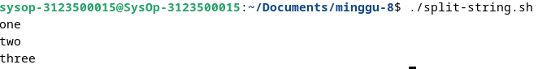

<div align="center">
  <h1 style="text-align: center;font-weight: bold">Praktikum 8<br>Bash Tutorial</h1>
  <h4 style="text-align: center;">Dosen Pengampu : Dr. Ferry Astika Saputra, S.T., M.Sc.</h4>
</div>
<br />
<div align="center">
  
  <h3 style="text-align: center;">Disusun Oleh : </h3>
  <p style="text-align: center;">
    <strong>Calvin Raditya Sandy Winarto - 3123500009</strong><br>
    <strong>Zada Devi Mariama - 3123500015</strong>
  </p>
<h3 style="text-align: center;line-height: 1.5">Politeknik Elektronika Negeri Surabaya<br>Departemen Teknik Informatika Dan Komputer<br>Program Studi Teknik Informatika<br>2023/2024</h3>
  <hr><hr>
</div>

## Daftar Isi
1. [Dasar teori](#dasar-teori)
2. [Tugas](#tugas)
    - [Tugas Percobaan 5](#percobaan-5-menghentikan-dan-memulai-kembali-job)
    - [Tugas Percobaan 6](#percobaan-6-percobaan-dengan-penjadwalan-prioritas)
    - [Tugas Latihan](#latihan)
3. [Kesimpulan](#kesimpulan)

# Bash Tutorials
```text
Bash kependekan dari Bourne Again Shell, adalah penerjemah shell baris perintah dan bahasa skrip sumber terbuka. Ini menafsirkan perintah yang dimasukkan pengguna, baik secara interaktif atau dari file skrip. Ini berfungsi sebagai antarmuka untuk memanggil perintah, memungkinkan panggilan fungsi sistem.
```

Bash menjalankan perintah dari terminal atau file. Bahasa pemrograman yang beroperasi pada sistem operasi kernel Unix/Linux, berisi semua fitur untuk menulis kode lengkap.
Bash adalah tipe shell khusus yang menerima masukan dari perintah, menjalankan kode, dan memproses masukan, serta mengembalikan hasilnya.


## Ada dua jenis mode bash
- `Mode interaktif`
    Juga disebut penerjemah perintah, memungkinkan eksekusi perintah di terminal. Ini mengeksekusi perintah secara berurutan jika ada beberapa perintah.
- `Mode non-interaktif`
    Ini merujuk pada skrip, memungkinkan Anda menulis sintaksis Bash yang berisi rangkaian beberapa perintah untuk eksekusi skrip.

## Penggunaan Bash
- Menulis skrip untuk mengotomatiskan tugas pemrograman
- Menyinkronkan tugas untuk menyalin file
- Menjalankan tugas cron untuk penjadwalan

## Cara Menulis Kode Bash
- Di terminal, buat file menggunakan `vi test.sh`.
- Tambahkan `#!/bin/bash` di bagian atas file.
- Tambahkan beberapa cuplikan kode shell.
- Simpan file shell dengan `.sh` ekstensi.
- Jalankan skrip shell menggunakan `./test.sh` perintah di terminal.

## Jenis shell di OS Unix.

|   Shell Type    |         Alias        |    First Line   |
| --------------- |  ------------------  | --------------- |
|       sh        |   Bourne Shell       |   #!/bin/sh     |
|      bash       |   Bourne Again shell | 	 #!/bin/bash   |
|      cshell     |      C shel          | 	 #!/bin/csh    |

## Perbedaan Command Line dan Script Bash

|   Command Line    |         Script Bash        |
| --------------- |  ------------------  |
|       Baris perintah memiliki prompt yang menerima masukan dari pengguna        |   Mendukung banyak perintah dalam satu file     |
|      Perintah tidak disimpan ke file.       |   Prompt masih dapat ditulis dalam file skrip |
|      Ini hanya mendukung satu perintah pada satu waktu.     |     Hanya satu baris dalam sebuah file yang dijalankan secara berurutan          |

# Bash Shell Variable
```text
Variabel berfungsi sebagai wadah yang digunakan untuk menyimpan data dalam pemrograman. Ini mencakup penunjuk ke lokasi memori data.
```

Deklarasikan variabel
Untuk membuat variabel harus memberikan nilai pada variabel tersebut.
```
variableName=VariableValue
```

### Variable Scopes
Setiap variabel yang dideklarasikan harus memiliki ruang lingkup, yang menentukan di mana variabel tersebut dapat digunakan dalam program. Misalnya, jika suatu variabel dideklarasikan di dalam suatu fungsi, maka variabel tersebut hanya tersedia di dalam fungsi tersebut dan tidak dapat diakses di luar fungsi tersebut.

Cakupan variabel di Bash dapat didefinisikan dengan dua cara
- Variabel global
- Variabel lokal

### Bash Global Variables
```
Variabel default yang dideklarasikan dalam skrip shell
```
Variabel global dapat diakses dalam suatu fungsi atau blok bersarang apa pun dari file script shell.
```
    setAge() {
        echo "Inside Function Age: $AGE"
    }
    AGE=40
    setAge
    echo "Script Age: $tmp"
```
<br>
Output<br>
<br>

### Bash Local variables
```text
Variabel lokal dideklarasikan di dalam blok kode atau fungsi. Cakupan variabel-variabel ini hanya terlihat di dalam blok tempat variabel-variabel tersebut dideklarasikan.
```
Syntax
```
    local variablename=variablevalue
```
variabel dideklarasikan dan ditetapkan dengan keywoard `local`.\
\
Output\


### Nama variabel
```
Berisi kombinasi huruf apa saja (a sampai z, A sampai Z), angka (0 sampai 9), dan garis bawah (_).
```
`VariableValue` adalah nilai yang disimpan dalam variabel, dan dapat berupa string angka atau boolean. Simbol sama dengan (=) digunakan untuk memberikan nilai pada suatu variabel.
```
AGE=25
```
\
Variabel bernama AGE dibuat dan diberi nilai 25\
Output\


### Mengakses Variabel di Bash
Variabel dapat diakses menggunakan simbol dolar `$` diikuti dengan nama variabel.
```
    AGE=25
    echo $AGE
```
Variabel dapat diubah ke nilai baru menggunakan operator penugasan `=`.
```
    AGE=20
    echo $AGE

    AGE=30
    echo $AGE
```

Output


### Cara agar variabel tidak dapat diperbarui
Kata `readonly` kunci mencegah variabel diperbarui, secara efektif mengubahnya menjadi `constant`.\
\
AGE adalah sebuah batasan, menetapkan nilai baru akan menimbulkan kesalahan, dan pesan kesalahannya adalah AGE: is `readonly`.\


### Bash unset variable
Kata `unset` kunci membantu menghilangkan nilai dari variabel yang ditentukan. Variabel tetap dapat diakses tetapi mencetak nilai kosong

\
Output\


### Variabel typing
```
declare options variablename=value
```

- variabel dideklarasikan dan diberi nilai.
- Options berisi opsi untuk membuat tipe variabel.
- declare -a variabel=

|  Tipe Variabel  |        Sintaks       |    Keterangan   |
| --------------- |  ------------------  | --------------- |
| Array | declare -a variabel | mendeklarasikan variabel indexedarray yang menyimpan string |
| Associated Array | declare -A variabel | Associated Array |
| Integer | declare -i variable | Associated Array |
| Readonly | declare -r variable | tidak dapat diubah atau tidak disetel |
| Export | declare -x variable | ekspor variabel dan digunakan oleh semua child process |

### Menampilkan Variabel Lingkungan di Bash
Ada dua jenis perintah untuk mencetak variabel lingkungan di Bash
```
printenv​
env​
```

### Penamaan Variabel
- Variabel dibaca dengan mengawali simbol `$`.
- Nama variabel terdiri dari huruf, angka, atau garis bawah.
- Variabel peka huruf besar-kecil; misalnya, test dan Test dianggap sebagai dua variabel berbeda dalam script.
- Meskipun nama variabel biasanya ditulis dalam HURUF BESAR, Anda dapat membuatnya menggunakan huruf UPPER atau LOWER jika diperlukan. Dan variabel Lingkungan dan Shell keduanya dalam huruf besar.
- Nama variabel tidak boleh mengandung spasi.
- Nama-nama biasanya harus `camelCase`. Contoh `firstName`

### Shell variables
Variabel shell adalah variabel yang diatur oleh shell, bukan oleh pengguna. Ini diperlukan oleh shell agar dapat bekerja dengan lancar

|     Variabel    |       Keterangan     |
| --------------- |  ------------------  |
|       PWD        | Direktori kerja saat ini |
|      Set-Location       |   Ubah direktori kerja ke direktori baru |
|      Ganti Nama Item     |     Ganti Nama File         |
|      IFS     | Pemisah Bidang Internal secara default adalah spasi, diatur oleh Shell, Digunakan untuk pemisahan string |
|      PATH     | Berisi jalur perintah yang dipisahkan titik koma, Dikonfigurasi untuk mencari perintah |
|      UID     | Mencetak nomor Identifikasi Pengguna |
|      Home     | Direktori beranda pengguna saat ini |

# Bash Loop File
### Cara membaca file demi baris di Shell Bash
- menggunakan perulangan while<br>
 
Output<br>
 

# Bash Comments
```text
Comments adalah pernyataan kode yang berisi teks yang dapat dibaca pengguna yang dilewati shell selama eksekusi. Setiap bahasa pemrograman menyertakan fitur komentar, yang memberikan deskripsi baris kode atau pernyataan.
```

### Ada dua jenis Komen
- __Komentar tunggal__
    dilambangkan dengan simbol `#` di awal setiap baris.

    <br>
    Output<br>
    <br>

- __Komentar multi baris__
    - Cara pertama<br>
    memanfaatkan komentar satu baris yang setiap barisnya dimulai dengan simbol komentar satu baris.
    dilambangkan dengan simbol `#` di awal setiap baris.
        ```
        # Line1 comments
        # Line2 comments
        # Line3 comments
        ```
    - Cara Kedua<br>
        Untuk membuat komentar multi-baris adalah dengan mengapit beberapa baris di dalam `( : )` dan `( ' )`.
        ```
        : '
        multiline comments contoh1
        multiline comments contoh2
        multiline comments contoh3
        '
        echo "testing multi-line comments"
        ```

# Bash Array
    Array di shell adalah variabel yang menyimpan lebih dari satu nilai.
### cara mendeklarasikan dan membuat array
- array index<br>
elemen array disimpan dengan indeks mulai dari nol
- array asosiatif<br>
array disimpan dengan pasangan nilai kunci

### Deklarasi Array
<br>
sebuah array dideklarasikan dengan kata kunci `declare` dengan opsi `-a` atau `A`

### Contoh array index
<br>

Array ini adalah penyimpanan dengan indeks=0, ditambah 1
<br>

### contoh array asosiatif
Array ini adalah penyimpanan dengan indeks=0, ditambah 1
<br>

`arrayvariable` indeks array dideklarasikan dan diberi nilai.

### Mengakses Nilai Array
    ${array_name[index]}

### Deklarasikan Array angka dan ulangi
Array dapat berisi angka dan loop for untuk
<br>
Output<br>
<br>


### Mengakses elemen pertama dan terakhir array
Pertama<br>
<br>
Output<br>


Terakhir<br>
<br>
Output<br>
<br>

### Mencetak semua elemen array
Menggunakan `[@]` atau `[*]`<br>
<br>

Output<br>
<br>

### Menghapus Elemen dari array
menggunakan `unset` indeks tertentu.<br>
<br>

Output<br>
<br>

### Menambahkan elemen ke array
```
array[index]=value
```

Menambahkan elemen awal, tengah dan akhir.
<br>

Output<br>
<br>

## Array cheat sheet examples

|     Example     |        Description        |
| --------------- |  ------------------  |
|       declare -a array        |   	Deklarasi array indeks       |
|       declare -A array        |   Deklarasi array Asosiatif       |
|       declare -a array=()        |   	Deklarasi array indeks dengan array kosong       |
|       array=()        |   Buat array kosong dengan menyatakan valid       |
|       array=(1 6 3)        |   Inisialisasi array dengan angka       |
|       array=(one two three)        |   Inisialisasi array dengan string       |
|       array=(one two 1)        |   Inisialisasi array dengan data campuran       |
|       ${array[0]}        |   Dapatkan elemen pertama       |
|       ${array[1]}        |   Dapatkan elemen kedua       |
|       ${array[-1]}       |   Dapatkan elemen terakhir       |
|       ${array[@]}        |   Dapatkan Semua elemen       |
|       ${array[*]}        |   Dapatkan Semua elemen       |
|       ${!array[!]}       |   Dapatkan Semua indeks       |
|       ${#array[!]}       |   Panjang array       |
|       array[0]=12        |   Tambahkan elemen ke array di posisi pertama.yaitu indeks=0       |
|       array[-1]=22       |   Tambahkan elemen ke array di posisi terakhir       |
|       array+=(11)        |   	Tambahkan nilai ke array       |
|       ${array[@]:k:i}    |   Dapatkan elemen indeks=1 dimulai dari indeks=k       |


# Bash Expansion
```text
cara menulis skrip batch dalam skrip shell dan menjalankannya adalah dengan memasukkan perintah ke OS untuk membuat panggilan sistem dan melakukan tindakan. perintah masukan pengguna di terminal untuk melakukan operasi seperti ls, cd, mkdir dll.
```

Cara lain, Beberapa perintah dapat ditempatkan dalam satu file, juru bahasa bash membaca perintah dan menjalankannya

Cara menulis skrip shell di bash
- Pilih Editor atau editor teks
- Buat file dengan ekstensi .sh atau .bash
- Tulis perintah dalam file
- Simpan file sebagaihello.sh

<br>
Output<br>
<br>

# Bash - Conditional Expression
Ada berbagai jenis ekspresi konisional di Bash
- Operator Perbandingan String
- Operator Perbandingan Numerik
- Operator File
- Operator Logis

### File Operators
```text 
Bash menyediakan operator logika pada FIle dan direktori untuk menguji ekspresi kondisional. Ini memungkinkan Anda untuk memeriksa berbagai operasi seperti keberadaan, dan izin, ukuran. Ini digunakan ekspresi kondisional dalam pernyataan kondisional seperti if else dan case.
```

<br>

conditiona_expressions berisi opsi, dan jalur file, yang selalu mengembalikan nilai benar atau salah.

## Opsi yang disediakan

|     Operator    |       Deskripsi     |
| --------------- |  ------------------  |
|       -e file        | Mengembalikan nilai true jika file yang diberikan ada, di mana file bisa berupa file biasa atau direktori |
|      -f file      |   Mengembalikan nilai true jika file yang diberikan ada dan merupakan sebuah file (bukan direktori) |
|      -d file     |     Mengembalikan nilai true jika file adalah sebuah direktori         |
|      -r file     | Mengembalikan nilai true jika file ada dan memiliki izin baca |
|      -w file     |Mengembalikan nilai true jika file ada dan memiliki izin tulis |
|      -x file     | Mengembalikan nilai true jika file ada dan memiliki izin eksekusi |
|      -s file     | Mengembalikan nilai true jika file ada dan ukurannya tidak kosong |
|      -G file     | Mengembalikan nilai true jika file ada dan dimiliki oleh sebuah ID Grup yang cocok |
|      -O file     | Mengembalikan nilai true jika file ada dan dimiliki oleh sebuah ID Pengguna yang cocok |
|      -N file     | Mengembalikan nilai true jika file ada dan telah dimodifikasi sejak baca terakhir |
|      -L file     | Mengembalikan nilai true jika file ada dan merupakan sebuah tautan simbolik |
|      file1 -ot file2     | Mengembalikan nilai true jika file1 lebih tua dari file2, atau jika file2 ada dan file1 tidak ada |
|      file1 -ne file2     | Mengembalikan nilai true jika file1 lebih baru dari file2, file1 ada, dan file2 tidak ada |
|      file1 -ef file2    | Mengembalikan nilai true jika file1 dan file2 menunjuk ke perangkat dan inode yang sama |


# Bash - Case Statements
```text
Pernyataan case mirip dengan switch case dalam bahasa pemrograman lain. Ini digunakan untuk membandingkan masukan yang diberikan dengan beberapa pola, dan perintah di dalam pola yang cocok dijalankan.
```

<br>
- Ekspresi adalah variabel atau ekspresi yang valid untuk dievaluasi
- Berisi pola defiend di dalam case yang dievaluasi dengan membandingkan ekspresi, mencocokkan case fuound, mengeksekusi perintah di dalamnya.
- default case(*) untuk dieksekusi jika tidak ada pola yang cocok
- Setiap blok pola diakhiri dengan ;;
- Case adalah kata awal dan esac adalah kata yang mengakhiri pernyataan case

<br>
Output<br>
<br>

# Bash - Special Characters
```text
Karakter khusus di bash dievaluasi dengan arti khusus dalam interpretasi suatu perintah. Karakter-karakter ini memiliki instruksi khusus, penggunaan karakter ini memiliki arti berbeda dalam konteks berbeda Blankspace(" "): Ini juga disebut spasi putih, berisi tab, spasi, kembali, baris baru. Ini memberitahu penerjemah bash untuk memisahkan perintah dan konten. Ini adalah pembatas untuk memisahkan perintah dan string.
```

<br>
Output<br>
<br>

### Expansion($)
```text
Simbol tanda dolar digunakan untuk berbagai jenis perluasan parameter perluasan,(variabel{variabel}) Substitusi, ($(ekspresi)) ekspresi artema ($((ekspresi))).
```

### Ambersand(&)
```text
Menambahkan & di akhir perintah memungkinkan Anda menjalankan perintah di latar belakang.
```

<br>

### Single quotes
```text
Single quotes (') are used to define a string without a special meaning. It means all the variables and expansion are not interepreted and print the same literal string
```

<br>
Output<br>
<br>

__Jika kutipan tunggal berisi kutipan tunggal bersarang, Anda harus menghindarinya menggunakan ```.__

<br>
Output<br>
<br>

### Double qoutes
```text
Tanda kutip ganda (') digunakan untuk mendefinisikan string literal dengan arti khusus.

jika string berisi variabel dan sintaks perluasan, Ini diinterprestasikan dan diperluas, dengan nilai yang dievaluasi saat runtime.

jika string tidak ingin memperluas variabelnya, maka Anda dapat keluar dari \ sebelum simbol $ dolar
```

<br>
Output<br>
<br>

### Backslash Character ( \ )
```text
Karakter garis miring terbalik digunakan untuk keluar dari karakter dalam string. ini digunakan dalam string yang dikutip ganda.
```

<br>
Output<br>
<br>

### Comment ( # )
```text
Simbol komentar digunakan untuk mengomentari sebaris kode. Baris komentar selalu dimulai dengan #. Itu diabaikan oleh penerjemah bash.
```

<br>
Output<br>
<br>

# Bash - if elif else
```text
Skrip Bash menyediakan ekspresi kondisional untuk mengeksekusi kode berbeda berdasarkan kondisi yang ditentukan.

Pernyataan Bersyarat Bash Shell Terkadang, Anda mungkin perlu mengeksekusi beragam blok kode bergantung pada berbagai keputusan berdasarkan kondisi tertentu.
```

Skrip Bash memfasilitasi hal ini melalui pernyataan kondisional

<br>

### If Conditional Statements
```text
Pernyataan if di Bash digunakan untuk mengeksekusi blok kode ketika kondisi yang ditentukan benar.
```

<br>

### Example
<br>
Output<br>
<br>

### If..Elif..Else Statements
```text
Gunakan pernyataan kondisional if..elif..else di Bash untuk mengeksekusi blok kode yang berbeda berdasarkan beberapa kondisi.
```
\
Output\
\

# Bash - Loops
```
Loop digunakan untuk mengeksekusi blok kode beberapa kali.
```

Misalkan Anda ingin menjalankan perintah berulang kali atau mencetak array.for loop digunakan di Bash
- for loop
- for index loop
- while loop
- until loop


#### For Loop
```text
for loop digunakan untuk mengeksekusi kode beberapa kali berdasarkan
```

<br>

### Example
\
Output\


### For index loop
```text
untuk loop indeks mirip dengan bahasa C untuk loop indeks. Ini mengeksekusi kode beberapa kali berdasarkan kondisi benar, Ini dimulai dengan nilai awal dan iterasi berisi nilai yang akan bertambah 1.
```


### Example
\
Output\


### While Loop
```text
Perulangan while di Bash memungkinkan eksekusi kode berulang selama kondisi yang ditentukan benar. Jika kondisi menjadi salah, perulangan akan keluar.
```

Struktur dasar perulangan while adalah sebagai berikut:
\

### Example
\
Output\


### Until Loop
```text
Kata kunci sampai di Bash digunakan untuk mengeksekusi kode berulang kali hingga kondisi yang ditentukan menjadi benar, di mana loop keluar.
```

#### Struktur dasar dari perulangan sampai adalah sebagai berikut.
\

### Example
\
Output\


# Bash - Append String
### Bash Athematic expressions
Ekspresi artema digunakan untuk melakukan operasi matematika
```text
Ekspresi adalah istilah yang digunakan dalam matematika untuk menunjukkan suatu operasi. Ini berisi operan dan operator untuk melakukan operasi matematika. a<b adalah ekspresi. Ini mungkin berisi operator biner atau unary Di bash, Ekspresi dibuat menggunakan tanda kurung (()) dengan operan dan operator sebagai argumen. ((a)) adalah ekspresi bash.
```
\
- Operasi matematika dapat berisi sub ekspresi yang dipisahkan dengan koma.
### Example
\
Output\


Ekspresi artema dibuat menggunakan operator di bawah ini
- Operator Artmatik
- Operator Perbandingan
```text
Operator perbandingan digunakan untuk mengecek satu sama lain dengan membandingkan nilai Operator (<, <=, >, >=, ==, !=)
```
\
Output\


- Operator Logis
- Pernyataan bersyarat

### Bash Athematic Expansion
```text
Ekspansi sama dengan ekspresi, Ekspansi menghitung nilai ekspresi dan hasilnya diganti dengan nilai. Itu selalu diawali dengan tanda dolar.
```

\
Misalnya menghitung rata-rata dua angka, cetak hasilnya. Di sini digunakan sintaks ekspansi, Ini mengevaluasi ekspresi dan hasilnya diganti dengan output ekspresi.\
\
Output\


# Bash - Functions
```text
Fungsi adalah kode yang dapat digunakan kembali dan dikelompokkan dalam satu nama. Mendeklarasikan suatu fungsi Memanggil Fungsi Fungsi dengan argumen Cakupan variabel dalam Fungsi

Definisi fungsi berisi beberapa baris kode yang akan dieksekusi.
Fungsi berisi nama fungsi yang diapit {}.
```

<!-- Itu dapat dideklarasikan dengan dua cara, yaitu


Cara meneruskan parameter ke suatu fungsi


Parameter dapat diakses menggunakan $1 $2 $3.. $n
 -->

# Bash - Append String
### Simple variable append
```text
Mulailah dengan mendeklarasikan dua variabel string dalam skrip Bash, yang dapat dicetak ke konsol menggunakan echo dengan mengapit variabel dalam tanda kutip ganda.
```
\
Output\


Contoh lain melibatkan penggabungan string ke variabel yang sama dan mencetaknya ke konsol

\
Output\


Operator aritmatika singkatan (+=) biasanya digunakan dalam aritmatika untuk menambahkan nilai ke suatu variabel. Ini juga dapat digunakan untuk string untuk menambahkan string ke variabel.
Misalnya.
- a+=1 setara dengan a=a+1 dalam hal angka.
- str+="test" akan menjadi str=str+"test" dalam kasus string.

#### Contoh
\
Output\


### Use printf command
```text
printf digunakan untuk memformat string dengan berbagai opsi pemformatan yang kompleks. Kita dapat menggunakan perintah printf untuk menggabungkan string. Formatnya adalah %s%s, yang menambahkan dua variabel string.
```

\
Output\


### Using here string
```text
String adalah sintaks khusus untuk meneruskan string ke perintah dalam skrip Bash. Mereka digunakan untuk meneruskan string input tanpa menggunakan sumber lain, seperti file. Ini memungkinkan meneruskan string ke perintah Bash apa pun dari file atau baris perintah.
```

\

### Example
\
Output\


# Bash - Operators
### Apa itu operator?
```text
Operator adalah simbol dalam pemrograman yang melakukan suatu operasi pada operan
```

### Bash Arithmetic Operators
```text
Operator aritmatika di Bash menyediakan operasi aritmatika seperti operator penjumlahan, pembagian, pengurangan, dan perkalian pembagian.
```


| Operator | Title            | Description                            | Example      |
|----------|------------------|----------------------------------------|--------------|
| +        | Addition         | Penambahan dua atau lebih operand      | p+q=50       |
| -        | Subtraction      | Pengurangan dua atau lebih operand     | q-p=10       |
| *        | Multiplication   | Perkalian dua atau lebih operand       | p*q=600      |
| /        | Divide           | Menghasilkan hasil bagi setelah pembagian nilai | q/p=1.5 |
| %        | Modulus          | Mengembalikan sisa setelah pembagian nilai | q%p=10    |
| -expr    | Unary Minus      | Balik dari sebuah ekspresi             | -(10-7) is -3|
| ~/       | Division Int     | Mengembalikan nilai pembagian int      | (10~/7) is 1 |
| ++       | Increment        | Menambahkan nilai sebesar 1            | ++p=21       |
| --       | Decrement        | Mengurangi nilai sebesar 1             | --q=29       |

Operator penugasan digunakan untuk menetapkan nilai ke suatu variabel. Operasi dasarnya sama dengan (=) Selain itu, Ada operator penugasan lainnya.

### misalnya, p adalah 20
| Operation          | Symbol | Description                            | Result                |
|--------------------|--------|----------------------------------------|-----------------------|
| Add Assign         | +=     | Penambahan dan penugasan ke variabel  | ((p += 3)) adalah 23 |
| Subtract Assign    | -=     | Pengurangan dan penugasan ke variabel | ((p -= 3)) adalah 17 |
| Multiplicate Assign| *=     | Perkalian dan penugasan ke variabel   | ((p *= 2)) adalah 40 |
| Division Assign    | /=     | Pembagian dan penugasan ke variabel   | ((p /= 5)) adalah 4  |

### Bitwise Operators
| Operation      | Symbol | Description                                | Result                  |
|----------------|--------|--------------------------------------------|-------------------------|
| AND            | &      | Bitwise AND dari dua operand               | $op1 & $op2 adalah 0    |
| AND Equal      | &=     | Bitwise AND Equal dari dua operand         | $op1 & $op2 adalah 0    |
| OR             | \|     | Bitwise OR dari dua operand                | $op1 \| $op2 adalah 7   |
| XOR            | ^      | Bitwise XOR dari dua operand               | $op1 ^ $op2 adalah 7    |
| Left Shift     | <<     | Bitwise Left Shift dari dua operand        | $op1 & $op2 adalah 0    |
| Left Shift Eql | <<=    | Bitwise Left Shift Equal dari dua operand  | $op1 \| $op2 adalah 7   |
| XOR            | ^      | Bitwise XOR dari dua operand               | $op1 ^ $op2 adalah 7    |
| XOR Equal      | ^=     | Bitwise XOR Equal dari dua operand         | $op1 ^ $op2 adalah 7    |

### Logical operators
```
Operator ini digunakan untuk melakukan operasi logika pada variabel/ekspresi/data.
```

| Operation      | Symbol | Description                                                                   | Result                   |
|----------------|--------|-------------------------------------------------------------------------------|--------------------------|
| Logical AND    | &&     | Mengembalikan true (status keluaran=0) jika kedua operan adalah true, jika tidak, mengembalikan false (status keluaran bukan nol) | $op1 && $op2 adalah 0    |
| Logical OR     | \|\|   | Logical OR dari dua operan                                                   | $op1 \| $op2 adalah 0    |
| Logical NOT    | !      | Membalikkan nilai kondisional.                                               | $op1 adalah 7            |

### String Comparision Operator
| Operation   | Description                                                              |
|-------------|--------------------------------------------------------------------------|
| -z String   | Mengembalikan true jika string kosong, jika tidak, false.                |
| -n String   | Mengembalikan true jika string tidak kosong.                              |
| str1=str2   | Mengembalikan true jika str1 sama dengan str2.                           |
| str1!=str2 | Mengembalikan true jika str1 tidak sama dengan str2.                     |
| str1>str2  | Mengembalikan true jika str1 diurutkan sebelum str2.                     |
| str1<str2  | Mengembalikan true jika str1 diurutkan setelah str2.                     |


### Numerical Comparision Operator
```
Berikut ini adalah operator Perbandingan, menggunakan operator -eq dalam pernyataan kondisional if fi
```


### Example
\
Output\


<!-- ### Other Operators -->


# Bash - Numbers Comparasion
```
    Angka dapat berupa bilangan bulat atau angka mengambang.
```

Cara Memeriksa apakah dua angka sama atau tidak di Bash Program ini mengambil nilai masukan dan memeriksa apakah dua nilai sama atau tidak.


Beberapa skrip shell tidak mendukung (()), gunakan [[]] dengan operator Perbandingan

Berikut ini adalah operator Perbandingan.
- persamaan: sama
- Periksa apakah dua variabel sama
- ne : Tidak setara
- Periksa apakah dua variabel tidak sama
- lt : Kurang dari
- Periksa apakah variabel pertama lebih kecil dari variabel kedua
- le : Kurang dari sama
- Periksa apakah variabel pertama kurang dari sama dengan variabel kedua
- gt : Lebih besar dari
- Periksa apakah variabel pertama lebih besar dari variabel kedua
- ge: Lebih besar dari atau sama

Bandingkan Periksa apakah variabel pertama lebih besar dari sama dengan variabel

### kedua menggunakan operator -eq dalam pernyataan kondisional if fi


Anda juga dapat melakukannya dengan operator ternary.
```
  first=13
  second=15

  echo $(( first == second ? "equal": "not equal" ))
```

# Bash - Check Directory
### periksa direktori yang ada dan cetak pesannya
```text
Ekspresi kondisional berisi opsi -d dan jalur direktori. Opsi -d yang memeriksa apakah direktori ada atau tidak.
```

### Example
\
_Harap dicatat bahwa tambahkan spasi setelah [ dan sebelum -d._\
Output\


Diperiksa apakah direktori tersebut ada menggunakan -d. else blok akan memiliki kode untuk tidak ada dan membuat direktori menggunakan jalur direktori\
\
Output\


### Periksa direktori yang ada menggunakan sintaks ternary
Alternatifnya, ekspresi kondisional ternary digunakan sebagai pengganti ekspresi kondisional if.\


Periksa apakah ada beberapa direktori Terkadang, Kami ingin memeriksa apakah ada beberapa direktori. Kita harus menggunakan pernyataan kondisional if dengan operator logika AND(&&).\


### Periksa direktori ada dan dapat ditulis dan dieksekusi
Dalam contoh ini, Kode memeriksa hal-hal di bawah ini\
foldernya ada atau tidak jika ada, Folder tersebut memiliki izin untuk menulis dan dieksekusi. Terakhir, Cetak pesan string

#### Example
\
Output\


### Periksa file atau direktori ada
Terkadang, kami ingin memeriksa apakah file atau direktori tersebut ada. Opsi -e memeriksa file atau direktori untuk jalur yang diberikan ada atau tidak.

\
Output\


# Bash - File Name
File Name mencakup:

- Ekstrak nama file untuk path lengkap yang diberikan
- Mendapatkan nama file lengkap
- Nama ekstensi

### Ekstrak nama file dengan ekstensi

Untuk mendapatkan nama file beserta ekstensinya, perintah basename dapat digunakan untuk menghapus direktori dan hanya mengembalikan nama file untuk jalur tertentu, baik itu variabel atau string.

Misalnya, jika jalurnya adalah `/home/john/run.sh`, nama file yang dikembalikan adalah `run.sh`. Proses ini melibatkan pengambilan jalur lengkap dan hanya mengekstrak nama file dengan menghapus jalurnya. Nama file yang dihasilkan kemudian disimpan dalam variabel dan dicetak ke konsol.

nama dasar digunakan untuk menghapus direktori dan mengembalikan nama file untuk jalur yang diberikan. jalurnya adalah variabel atau string. Misalnya, jalurnya adalah `/home/john/run.sh`, dan nama file yang dikembalikan adalah `run.sh`. Dalam hal ini, jalur lengkap diberikan dan mengembalikan nama file dengan menghapus jalurnya.

Nama file disimpan ke variabel dan dicetak ke konsol.
### Example
\
Output\


### Ekstrak nama file tanpa ekstensi
Untuk mendapatkan hanya nama file tanpa ekstensi, Anda dapat menggunakan sintaks `${filename%.*}`.

Misalnya, pertimbangkan jalur `/home/john/run.sh`, nama file yang dihasilkan adalah `run.sh`.
Awalnya, perintah nama dasar digunakan untuk menghilangkan direktori dan menghasilkan nama file untuk jalur yang ditentukan dan mengembalikan variabel, dan variabel ini kemudian digunakan bersama dengan sintaks ekspresi untuk menghapus ekstensi dari nama file.

Ekspresi ini secara efektif menghapus ekstensi dari nama file.
### Example
\
Output\


### Ekstrak ekstensi untuk jalur file
Untuk mengisolasi ekstensi file dari jalur file yang diberikan, `${filename##*.}` dapat digunakan. Ekspresi ini hanya mengembalikan ekstensi file.

Misalnya, pertimbangkan jalur `/home/john/run.sh `ekstensi yang dihasilkan adalah `sh`.

Awalnya, perintah nama dasar digunakan untuk menghapus jalur direktori dan mengembalikan nama file untuk jalur yang ditentukan, dan nama file ini kemudian digunakan bersama dengan sintaks ekspresi untuk mengembalikan ekstensi saja.

### Example
\
Output\


Berikut adalah contoh komprehensif yang menunjukkan cara mendapatkan nama file dengan atau tanpa ekstensi file. Setelah menjalankan skrip di bawah ini, skrip tersebut akan dicetak

- file dengan ekstensi,
- hanya nama file tanpa ekstensi,
- hanya ekstensinya saja.

### Example
\
Output\


# Bash - Split String
```text
Dalam beberapa kasus, saat bekerja dengan skrip bash, timbul kebutuhan untuk memisahkan string berdasarkan pembatas dan mengekstrak beberapa string untuk diproses lebih lanjut atau disimpan dalam variabel.
```

Split String ini membahas tiga metode.

- Pisahkan string menggunakan perintah awk
- Gunakan variabel IFS
- Ekspansi Parameter dengan for loop

### Pisahkan string menggunakan perintah awk dalam skrip bash shell

Perintah awk, utilitas Linux yang kompatibel dengan semua distribusi bash dan shell, digunakan untuk membagi string berdasarkan pembatas yang ditentukan.
Input diberikan menggunakan simbol pipa `( | )`, dan contoh di bawah ini menunjukkan pemisahan string yang mengandung titik dua `( : )`

### Example
\
Output\

dibagi menggunakan variabel IFS Di sini, string masukan terdiri dari elemen yang dipisahkan oleh tanda hubung. Variabel shell IFS (Internal Field Separator) diatur ke tanda hubung, dan string diiterasi menggunakan for loop. Setiap elemen dicetak setelah tanda hubung dihilangkan.

### Example
\
Output\


### Gunakan ekspansi Parameter dan loop
Perluasan parameter digunakan untuk mengubah nilai variabel berdasarkan opsi yang ditentukan. Dalam hal ini, variabel string diubah menjadi array. Array kemudian diiterasi menggunakan sintaks for loop, mencetak setiap elemen ke konsol:

### Example
\
Output\


# Bash - String Length
```text
Panjang string ditentukan oleh jumlah karakter yang dikandungnya, dan umumnya mudah untuk memastikan panjangnya untuk teks normal. String Length ini akan membahas berbagai metode untuk menghitung jumlah karakter dalam sebuah string dengan pengkodean UTF.
```

### Menggunakan Sintaks ${#variable}

Metode pertama melibatkan penggunaan sintaks `${#variable}` untuk mendapatkan panjang variabel string.

### Example
\
Output\


### Menggunakan Perintah wc -m
Metode kedua melibatkan penggunaan perintah wc -m, baik secara langsung dengan string atau melalui variabel.

### Example
\
Dalam contoh ini, echo -n "string" digunakan untuk mencetak string tanpa baris baru (opsi -n). | operator pipa mengarahkan output dari perintah sisi kiri ke perintah sisi kanan, dan wc -m menghitung jumlah karakter dalam sebuah string.

Output\


### Menggunakan Perintah expr Metode lain melibatkan penggunaan perintah expr untuk mencari panjang string.

### Example
\
Output\


### Menggunakan perintah awk Awk menyediakan cara lain untuk menghitung panjang string menggunakan ekspresi.

### Example
\
Output\


# Bash - Bashrc
File `.bashrc` adalah file skrip bash yang dijalankan dalam kasus berikut
- Menggunakan eksekusi skrip bash.
- Bash shell dibuka dan dimulai secara interaktif.
```text
File .bashrc adalah skrip yang dijalankan saat pengguna login. File ini terletak di direktori home pengguna. Ini berisi variabel lingkungan dan preferensi pengguna yang akan dikonfigurasi dalam file ini.
```
__File `.bashrc` dapat dilihat menggunakan editor Vi atau Nano.__

```
nano ~/.bashrc
```


file `.bashrc` terletak di dua tempat
- Direktori home pengguna
    - File ini disembunyikan secara default. Lokasinya adalah `~/.bashrc` di mana `~` adalah pengguna saat ini yang login di direktori home.
- Direktori sistem
    - File ini terletak di `/etc/bash.bashrc`.

### Cara memuat ulang pengaturan .bashrc tanpa keluar dan masuk kembali?
```text
jika Anda membuat perubahan apa pun pada file .bashrc, Perubahan tidak akan langsung terlihat. Anda harus menutup dan memulai kembali sesi bash untuk melakukan perubahan.
```

#### Jalankan perintah berikut di  command prompt untuk memuat ulang konfigurasi `.bashrc` tanpa login kembali


<!-- <br>
<br> -->
